---
tags:
 - mermaid
 - charts
 - diagrams
 - syntax
 - graphs
---

# Mermaid

## Оглавление

+ [[#1. Структура синтаксиса]]
	+ [[#1.1. Валидность диаграмм]]
+ [[#2. Блок-схемы]]
	+ [[#2.1. Узел (по-умолчанию)]]
	+ [[#2.2. Узел с текстом]]
	+ [[#2.3. Графы]]
	+ [[#2.4. Фигуры узлов]]
	+ [[#2.5. Связи между узлами]]
	+ [[#2.6. Типы стрелок]]
	+ [[#2.7. Стрелки со множеством направлений]]
	+ [[#2.8. Минимальная длина связи]]
	+ [[#2.9. Спецсимволы, влияющие на отображение диаграмм]]
	+ [[#2.10. Подграфы]]
		+ [[#2.10.1. Ориентация в подграфах]]
	+ [[#2.11. Взаимодействие]]
	+ [[#2.12. Комментарии]]
	+ [[#2.13. Стилизация и классы]]
		+ [[#2.13.1. Стилизация связей]]
		+ [[#2.13.2. Стилизация линий]]
		+ [[#2.13.3. Стилизация узлов]]
		+ [[#2.13.4. Классы]]
		+ [[#2.13.5. Классы CSS]]
		+ [[#2.13.6. Класс, используемый по-умолчанию]]
	+ [[#2.14. Поддержка fontawesome]]
	+ [[#2.15. Объявления диаграмм с пробелами между вершинами и связями и отказ от использования точки с запятой]]
	+ [[#2.16. Конфигурация]]
		+ [[#2.16.1. Рендерер]]
		+ [[#2.16.2. Ширина]]
+ [[#3. Диаграммы последовательностей]]
	+ [[#3.1. Синтаксис]]
		+ [[#3.1.1. Участники]]
		+ [[#3.1.2. Акторы]]
		+ [[#3.1.3. Алиасы]]
		+ [[#3.1.4. Группирование]]
	+ [[#3.2. Сообщения]]
	+ [[#3.3. Активация]]
	+ [[#3.4. Примечания]]
	+ [[#3.5. Циклы]]
	+ [[#3.6. Альтернативные пути]]
	+ [[#3.7. Параллели]]
	+ [[#3.8. Критические участки]]
	+ [[#3.9. Прерывания]]
	+ [[#3.10. Подсветка фона]]
	+ [[#3.11. sequenceNumbers]]
	+ [[#3.12. Меню акторов]]
	+ [[#3.12.1. Продвинутый синтаксис меню]]
	+ [[#3.13. Стилизация]]
	+ [[#3.14. Настройка]]
	+ [[#3.15. Комментарии]]
+ [[#4. Диаграммы классов]]
	+ [[#4.1. Синтаксис]]
		+ [[#4.1.1. Класс]]
	+ [[#4.2. Определение класса]]
		+ [[#4.2.1. Метки классов]]
	+ [[#4.3. Определение членов класса]]
		+ [[#4.3.1. Тип возвращаемого значения]]
		+ [[#4.3.2. Обобщённые типы]]
		+ [[#4.3.3. Видимость]]
	+ [[#4.4. Определение отношений]]
		+ [[#4.4.1. Двусторонние отношения]]
	+ [[#4.5. "Кардинальность"/Множественность отношений]]
	+ [[#4.6. Аннотации к классам]]
	+ [[#4.7. Комментарии]]
	+ [[#4.8. Направление диаграммы]]
	+ [[#4.9. Взаимодействие]]
	+ [[#4.10. Заметки]]
	+ [[#4.11. Стилизаия]]
		+ [[#4.11.1. Стилизация узлов]]
		+ [[#4.11.2. Стили по-умолчанию]]
+ [[#5. Диаграммы состояний]]
	+ [[#5.1. Состояния]]
	+ [[#5.2. Переходы]]
	+ [[#5.3. Начало и конец]]
	+ [[#5.4. Составные состояния]]
	+ [[#5.5. Выбор/ветвление]]
	+ [[#5.6. Ветвления]]
	+ [[#5.7. Заметки]]
	+ [[#5.8. Параллелизм]]
	+ [[#5.9. Направление диаграммы]]
	+ [[#5.10. Комментарии]]
	+ [[#5.11. Стилизация при помощи classDef]]
		+ [[#5.11.1. Применение стилей classDef к состояниям]]
+ [[#6. Диаграммы отношений сущностей]]
	+ [[#6.1. Синтаксис]]
		+ [[#6.1.1. Сущности и отношения]]
		+ [[#6.1.2. Синтаксис отношений]]
		+ [[#6.1.3. Идентификация]]
		+ [[#6.1.4. Атрибуты]]
		+ [[#6.1.5. Дополнительно]]
	+ [[#6.2. Стилизация]]
+ [[#7. Диаграммы пути пользователя]]
+ [[#8. Gantt]]
	+ [[#8.1. Примечания]]
	+ [[#8.2. Синтаксис]]
		+ [[#8.2.1. Заголовок]]
		+ [[#8.2.2. Секции]]
		+ [[#8.2.3. Этапы]]
		+ [[#8.2.4. Даты]]
			+ [[#8.2.4.1. Входной формат дат]]
			+ [[#8.2.4.2. Формат вывода даты на оси]]
			+ [[#8.2.4.3. Шаги на оси]]
		+ [[#8.2.5. Вывод в компактном режиме]]
		+ [[#8.2.6. Комментарии]]
	+ [[#8.3. Стилизация]]
	+ [[#8.4. Маркер текущей даты]]
	+ [[#8.5. Конфигурация]]
	+ [[#8.6. Взаимодействие]]
+ [[#9. Круговые диаграммы]]
	+ [[#9.1. Синтаксис]]
	+ [[#9.2. Конфигурация]]
+ [[#10. Диаграммы требований]]
	+ [[#10.1. Синтаксис]]
		+ [[#10.1.1. Требование]]
		+ [[#10.1.2. Элемент]]
		+ [[#10.1.3. Отношения]]
+ [[#11. Gitgraph]]
	+ [[#11.1. Синтаксис]]
		+ [[#11.1.1. Создание пользовательского идентификатора коммита]]
		+ [[#11.1.2. Изменение типа коммита]]
		+ [[#11.1.3. Добавление тэгов]]
		+ [[#11.1.4. Создание новой ветки]]
		+ [[#11.1.5. Переключение на существующую ветку]]
		+ [[#11.1.6. Слияние двух веток]]
		+ [[#11.1.7. "Черри-пик" коммитов из других веток]]
		+ [[#11.1.8. Изменение очерёдности веток]]
	+ [[#11.2. Опции конфигурации Gitgraph]]
		+ [[#11.2.1. Сокрытие имён и линий веток]]
		+ [[#11.2.2. Отоброжение меток коммитов: повёрнутое и горизонтальное]]
		+ [[#11.2.3. Отображение меток коммитов]]
		+ [[#11.2.4. Именование основной ветки]]
		+ [[#11.2.5. Темы]]
		+ [[#11.2.6. Изменение цветовой схемы при помощи переменных тем]]
			+ [[#11.2.6.1. Изменение цветов веток]]
			+ [[#11.2.6.2. Изменение цвета имени ветки]]
			+ [[#11.2.6.3. Изменение цветов в метках коммитов]]
			+ [[#11.2.6.4. Изменение размера шрифта метки коммита]]
			+ [[#11.2.6.5. Изменение размера шрифта тэга]]
			+ [[#11.2.6.6. Изменение цветов тэгов]]
			+ [[#11.2.6.7. Изменение цвета подсвечиваемых коммитов]]
+ [[#12. Диаграммы C4]]
	+ [[#12.1. C4Context]]
	+ [[#12.2. C4Container]]
	+ [[#12.3. C4Component]]
	+ [[#12.4. C4Dynamic]]
	+ [[#12.5. C4Deployment]]
+ [[#13. Карты мыслей]]
	+ [[#13.1. Синтаксис]]
	+ [[#13.2. Фигуры]]
	+ [[#13.3. Пиктограммы и классы]]
		+ [[#13.3.1. Пиктограммы]]
		+ [[#13.2. Различные фигуры]]
	+ [[#13.4. Разметка строк]]
	+ [[#13.5. Интеграция с библиотеками и WEB-страницами]]
+ [[#14. Диаграммы временной шкалы]]
	+ [[#14.1. Синтаксис]]
	+ [[#14.2. Группирование временных периодов по секциям/поколениям]]
	+ [[#14.3. Свёртка текста для длительных периодов или событий]]
	+ [[#14.4. Стилизация временных периодов и событий]]
		+ [[#14.4.1. Изменение цветовой схемы]]
	+ [[#14.5. Темы]]
	+ [[#14.6. Интеграция с библиотеками и WEB-страницами]]
+ [[#Ссылки]]

## 1. Структура синтаксиса

Все определения диаграмм начинаются с объявления типа диаграммы, с последующим определением содержимого.  
Пример: код ниже сгенерирует _Диаграмму Отношений Сущностей_, для создания которой используется объявление `erDiagram`. Всё, что следует дальше - разные `Entities` этой самой диаграммы.

```markdown
erDiagram
	CUSTOMER }|..|{ DELIVERY-ADDRESS : has
	CUSTOMER ||--o{ ORDER : places
	CUSTOMER ||--o{ INVOICE : "liable for"
	DELIVERY-ADDRESS ||--o{ ORDER : receives
	INVOICE ||--|{ ORDER : covers
	ORDER ||--|{ ORDER-ITEM : includes
	PRODUCT-CATEGORY ||--|{ PRODUCT : contains
	PRODUCT ||--o{ ORDER-ITEM : "ordered in"
```

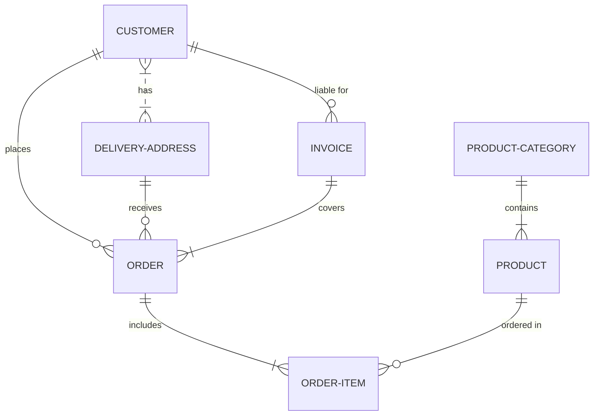

### 1.1. Валидность диаграмм

Необходимо соблюдать осторожность, поскольку некоторые слова или символы могут повлиять на корректность отображения диаграмм.

| Проблемные символы и ситуации | Причина | Решение |
| ------------------------ | --------- | ----------|
| **В комментариях** | | |
| `%%{``}%%` | Аналогично "Директивам" влияет на рендерер | В комментариях, использующих `%%`, избегать использования фигурных скобок. |
| **В блок-схемах** | | |
| `end` | Слово "End" может стать причиной проблем с отображением блок-схем и диаграмм последовательностей | Вложить слово в кавычки |
| Узлы внутри узлов | Вложенные примитивы "ломают" _Mermaid_ | "Обернуть" вложенные узлы в кавычки |

## 2. Блок-схемы

Все блок-схемы составляются из =="узлов"== (геометрических фигур) и =="рёбер"== (стрелок, линий и т. д.). Код _Mermaid_ определяет взаимодействие =="узлов"== и =="рёбер"==.  
Помимо этого, есть возможность использовать разные типы стрелок, стрелки с множеством направлений и соединение из и в подграфы.

### 2.1. Узел (по-умолчанию)

```markdown
---
title: Node
---
flowchart LR
	id
```

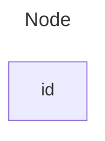

### 2.2. Узел с текстом

Существует возможность задать текст для узла. Если это было сделано несколько раз, будет использован последний упомянутый. Если же позднее будут определены рёбра для узла, определение текста можно будет отбросить.

```markdown
---
title: Node with text
---
flowchart LR
	id1[This is the text in the box]
```

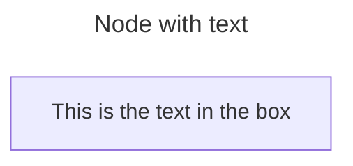

### 2.3. Графы

Рассмотрим направления в блок-схеме.  
Определения `TD` или `TB` задают ориентацию блок-схемы сверху вниз:

```markdown
flowchart TD
	Start --> Stop
```

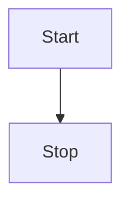

Определение `LR` задаёт ориентацию слева направо:

```markdown
flowchart LR
	Start --> Stop
```

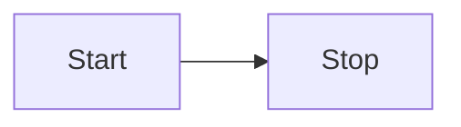

Возможные направления блок-схем:
 + `TB`, `TD` - сверху вниз
 + `BT` - снизу вверх
 + `RL` - справа налево
 + `LR` - слева направо

### 2.4. Фигуры узлов

Узел с закруглёнными углами:

```markdown
flowchart LR
	id1(This is the text in the box)
```

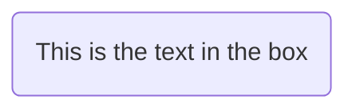

Узел в форме стадиона:

```markdown
flowchart LR
	id1([This is the text in the box])
```

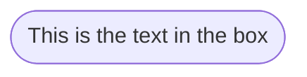

"Узел-подзадача":

```markdown
flowchart LR
	id1[[This is the text in the box]]
```

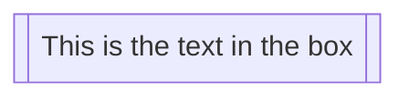

Узел в форме цилиндра:

```markdown
flowchart LR
	id1[(Database)]
```

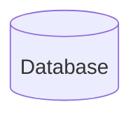

Круглый узел:

```markdown
flowchart LR
	id1((This is the text in the circle))
```

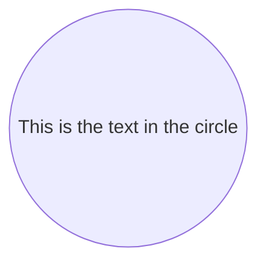

Узел асимметричной формы:

```markdown
flowchart LR
	id1>This is the text in the box]
```

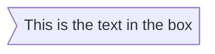

Узел в форме ромба:

```markdown
flowchart LR
	id1{This is the text in the box}
```

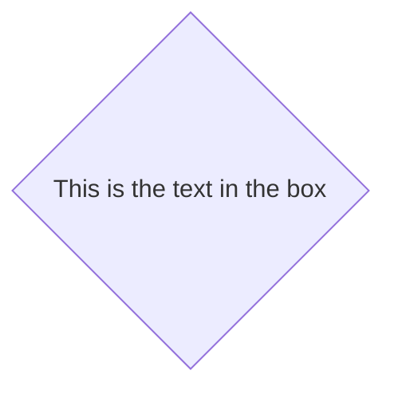

Узел в форме пятиугольника:

```markdown
flowchart LR
	id1{{This is the text in the box}}
```

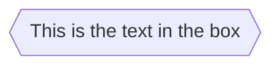

Узел в форме параллелограмма:

```markdown
flowchart TD
	id1[/This is the text in the box/]
```

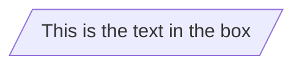

```markdown
flowchart TD
	id1[\This is the text in the box\]
```

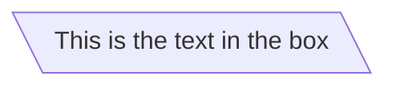

Узел в форме трапеции:

```markdown
flowchart TD
	A[/Christmas\]
```

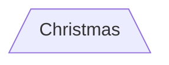

```markdown
flowchart TD
	A[\Go shopping/]
```

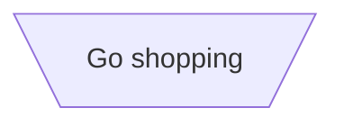

Узел в форме двойной окружности:

```markdown
flowchart TD
	id1(((This is the text in the circle)))
```

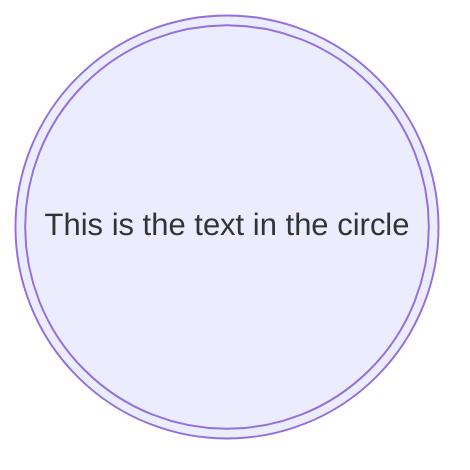

### 2.5. Связи между узлами

Узлы могут быть связаны рёбрами. Возможно использовать разные типы связей и прикреплять текстовые строки к ним.

Связь со стрелкой:

```markdown
flowchart LR
	A-->B
```

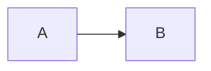

Открытая связь:

```markdown
flowchart LR
	A --- B
```

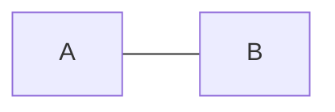

Текст на "рёбрах":

```markdown
flowchart LR
	A-- This is the text! ---B
```

```mermaid
flowchart LR
	A-- This is the text! ---B
```

```markdown
flowchart LR
	A---|This is the text|B
```

```mermaid
flowchart LR
	A---|This is the text|B
```

Связь со стрелкой и текстом:

```markdown
flowchart LR
	A-->|text|B
```

```mermaid
flowchart LR
	A-->|text|B
```

```markdown
flowchart LR
	A-- text -->B
```

```mermaid
flowchart LR
	A-- text -->B
```

Связь с линией "в точку":

```markdown
flowchart LR
	A-.->B;
```

```mermaid
flowchart LR
	A-.->B;
```

Связь с линией "в точку" и текстом:

```markdown
flowchart LR
 A-. text .-> B
```

```mermaid
flowchart LR
 A-. text .-> B
```

Жирная линия:

```markdown
flowchart LR
	A ==> B
```

```mermaid
flowchart LR
	A ==> B
```

Жирная линия с текстом:

```markdown
flowchart LR
	A == text ==> B
```

```mermaid
flowchart LR
	A == text ==> B
```

"Невидимая" связь:

```markdown
flowchart LR
	A ~~~ B
```

Цепочка связей:

```markdown
flowchart LR
	A -- text --> B -- text2 --> C
```

```mermaid
flowchart LR
	A -- text --> B -- text2 --> C
```

```markdown
flowchart LR
	a --> b & c--> d
```

```mermaid
flowchart LR
	a --> b & c--> d
```

Дополнительные примеры описания зависимостей:

```markdown
flowchart TB
	A & B--> C & D
```

```mermaid
flowchart TB
	A & B--> C & D
```

### 2.6. Типы стрелок

Существует несколько дополнительных типов стрелок для блок-схем:

```markdown
flowchart LR
	A --o B
	B --x C
```

```mermaid
flowchart LR
	A --o B
	B --x C
```

### 2.7. Стрелки со множеством направлений

См. следующйё пример:

```markdown
flowchart LR
	A o--o B
	B <--> C
	C x--x D
```

```mermaid
flowchart LR
	A o--o B
	B <--> C
	C x--x D
```

### 2.8. Минимальная длина связи

Каждый узел в блок-схеме имеет собственный ранг в отображаемом графе, т.е. вертикальный или горизонтальный уровень, зависимый от узлов, к которым он присоединён. По-умолчанию, связи могут охватывать любое количество рангов, но существует возможность дать указание об увеличении длины для любой связи, добавив дополнительные символы "дефиса" (`-`) в её определение:

```markdown
flowchart TD
	A[Start] --> B{Is it?}
	B -->|Yes| C[OK]
	C --> D[Rethink]
	D --> B
	B ---- > |No| E[End]
```

```mermaid
flowchart TD
	A[Start] --> B{Is it?}
	B -->|Yes| C[OK]
	C --> D[Rethink]
	D --> B
	B ----> |No| E[End]
```

Если "лейбл" связи написан в середине, дополнительные "дефисы" должны быть добавлены с правой стороны связи:

```markdown
flowchart TD
	A[Start] --> B{Is it?}
	B -- Yes --> C[OK]
	C --> D[Rethink]
	D --> B
	B -- No ----> E[End]
```

```mermaid
flowchart TD
	A[Start] --> B{Is it?}
	B -- Yes --> C[OK]
	C --> D[Rethink]
	D --> B
	B -- No ----> E[End]
```

Для всех других линий добавляются соответствующие им дополнительные символы:

| Тип линии/Длина | 1 | 2 | 3 |
| ------- | - | - | - |
| Линия | `---` | `----` | `-----` |
| Линия со стрелкой | `-->` | `--->` | `---->` |
| Жирная линия | `===` | `====` | `=====` |
| Жирная линия со стрелкой | `==>` | `===>` | `====>` |
| Линия "в точку" | `-.-` | `-..-` | `-...-` |
| Линия "в точку" со стрелкой | `-.->` | `-..->` | `-...->` |

### 2.9. Спецсимволы, влияющие на отображение диаграмм

Существует возможность избежать проблем с использованием некоторых спецсимволов, вкладывая текст в кавычки:

```markdown
flowchart LR
	id1["This is the (text) in the box"]
```

```mermaid
flowchart LR
	id1["This is the (text) in the box"]
```

Также возможно вставлять спецсимволы, используя имена символов **HTML** или коды этих символов со знаком решётки и завершая последовательность точкой с запятой:

```markdown
flowchart LR
	A["A double quote:#quot;"] -->B["A dec char:#9829;"]
```

```mermaid
flowchart LR
	A["A double quote:#quot;"] -->B["A dec char:#9829;"]
```

### 2.10. Подграфы

Синтаксис для использования подграфов следующий:

```markdown
subgraph title
	graph definition
end
```

Пример:

```markdown
flowchart TB
	c1-->a2
	subgraph one
	a1-->a2
	end
	subgraph two
	b1-->b2
	end
	subgraph three
	c1-->c2
	end
```

```mermaid
flowchart TB
	c1-->a2
	subgraph one
	a1-->a2
	end
	subgraph two
	b1-->b2
	end
	subgraph three
	c1-->c2
	end
```

Для подграфа можно создать уникальный идентификатор:

```markdown
flowchart TB
	c1-->a2
	subgraph ide1 [one]
	a1-->a2
	end
```

```mermaid
flowchart TB
	c1-->a2
	subgraph ide1 [one]
	a1-->a2
	end
```

Также можно устанавливать соединения от и к подграфам:

```markdown
flowchart TB
	c1-->a2
	subgraph one
	a1-->a2
	end
	subgraph two
	b1-->b2
	end
	subgraph three
	c1-->c2
	end
	one --> two
	three --> two
	two --> c2
```

```mermaid
flowchart TB
	c1-->a2
	subgraph one
	a1-->a2
	end
	subgraph two
	b1-->b2
	end
	subgraph three
	c1-->c2
	end
	one --> two
	three --> two
	two --> c2
```

#### 2.10.1. Ориентация в подграфах

Для каждого подграфа можно задать собственную ориентацию:

```markdown
flowchart LR
	subgraph TOP
		direction TB
		subgpaph B1
			direction RL
			i1 -->f1
		end
		subgraph B2
			direction BT
			i2 -->f2
		end
	end
	A --> TOP --> B
	B1 --> B2
```

```mermaid
flowchart LR
	subgraph TOP
		direction TB
		subgraph B1
			direction RL
			i1 -->f1
		end
		subgraph B2
			direction BT
			i2 -->f2
		end
	end
	A --> TOP --> B
	B1 --> B2
```

### 2.11. Взаимодействие

Существует возможность привязать нажатие кнопки мыши к узлу. Нажатие может вызвать выполнение скрипта **JS** или открыть ссылку в браузере.  
Этот функциона отключен, если выставлена конфигурация `securityLevel='strict'` и включен, если выставлена конфигурация `securityLevel='loose'`.

Синтаксис:

```markdown
click nodeId callback
clock nodeId call callback()
```

 + `nodeId` - идентификатор узла
 + `callback` - имя **JS**-функции, определённой на странице, отображающей диаграмму; функция будет вызвана с идентификатором узла в качестве параметра

Пример использования:

```html
<script>
	const callback = function () {
		alert('A callback was triggered');
	};
</script>
```

```markdown
flowchart LR
	A-->B
	B-->C
	C-->D
	click A callback "Tooltip for a callback"
	click B "https://www.github.com" "This is a tooltip for a link"
	click A call callback() "Tooltip for a callback"
	click B href "httpsL//www.github.com" "This is a tooltip for a link"
```

```mermaid
flowchart LR
	A-->B
	B-->C
	C-->D
	click A callback "Tooltip for a callback"
	click B "https://www.github.com" "This is a tooltip for a link"
	click A call callback() "Tooltip for a callback"
	click B href "httpsL//www.github.com" "This is a tooltip for a link"
```

По-умолчанию, ссылки открываются в том же окне/той же вкладке браузера, где и находится диаграмма. Существует возможность изменить данное поведение, добавив одно из ключевых слов к определению (поддерживаются: `_self`, `_blank`, `_parent` и `_top`):

```markdown
flowchart LR
	A-->B
	B-->C
	C-->D
	D-->E
	click A "https://www.github.com" _blank
	click B "https://www.github.com" "Open this in a new tab" _blank
	click C href "https://www.github.com" _blank
	click D href "https://www.github.com" "Open this in a new tab" _blank
```

```mermaid
flowchart LR
	A-->B
	B-->C
	C-->D
	D-->E
	click A "https://www.github.com" _blank
	click B "https://www.github.com" "Open this in a new tab" _blank
	click C href "https://www.github.com" _blank
	click D href "https://www.github.com" "Open this in a new tab" _blank
```

Заметка для новичков (полный пример использования интерактивных ссылок в контексте **HTML**):

```html
<body>
	<pre class="mermaid">
		flowchart LR
			A-->B
			B-->C
			C-->D
			click A callback "Tooltip"
			click B "https://www.github.com" "This is a link"
			click C call callback() "Tooltip"
			click D href "https://www.github.com" "This is a link"
	</pre>

	<script>
		const callback = function () {
			alert('A callback was triggered');
		};
		const config = {
			startOnLoad: true,
			flowChart: { useMaxWidth: true, htmlLabels: true, curve: 'cardinal' },
			securityLevel: 'loose',
		};
		mermaid.initialize(config);
	</script>
</body>
```

### 2.12. Комментарии

Комментарии могут быть вставлены в диаграмму и будут проигнорированы "парсером".  
Комментарии должны быть на отдельной строке и предваряться символами `%%`:

```markdown
flowchart LR
%% this is a comment A -- text -->B{node}
	A -- text --> B -- text2 --> C
```

```mermaid
flowchart LR
%% this is a comment A -- text -->B{node}
	A -- text --> B -- text2 --> C
```

### 2.13. Стилизация и классы

#### 2.13.1. Стилизация связей

Возможна стилизация связей. К примеру, можно стилизовать связь, идущую в обратную сторону в графе. Поскольку связи не имеют идентификаторов, как те же узлы, необходим способ определения того, какой "стиль" должен использоваться при создании связей. Вместо идентификаторов, используется порядковый номер связи в графе или же стиль применяется ко всем связям.

Пример того, как определённый стиль применяется к четвёртой (по порядку определения в графе) связи:

```markdown
linkStyle 3 stroke:#ff3,stroke-width:4px,color:red;
```

#### 2.13.2. Стилизация линий

Можно стилизовать линии, связывающие узлы. Доступные стили линий включают в себя: `basis`, `bumpX`, `bumpY`, `cardinal`, `catmullRom`, `linear`, `monotoneX`, `monotoneY`, `natural`, `step`, `stepAfter` и `stepBefore`.

В примере ниже, диаграмма с ориентацией слева направо использует стилизацию `stepBefore` для связывающих линий:

```markdown
%%{ init: { 'flowchart': { 'curve': 'stepBefore' } } }%%
graph LR
```

Для полного списка доступных стилей, обратитесь к [документации](https://github.com/d3/d3-shape/blob/main/README.md#curves) проекта [d3-shape](https://github.com/d3/d3-shape/).

#### 2.13.3. Стилизация узлов

Узлы также можно стилизавать. К примеру, задать толщину границ или цвет фона:

```markdown
flowchart LR
	id1(Start)-->id2(Stop)
	style id1 fill:#f9f,stroke:#333,stroke-width:4px
	style id2 fill:#bbf,stroke:#f66,stroke-width:2px,color:#fff,stroke-dasharray: 5 5
```

```mermaid
flowchart LR
	id1(Start)-->id2(Stop)
	style id1 fill:#f9f,stroke:#333,stroke-width:4px
	style id2 fill:#bbf,stroke:#f66,stroke-width:2px,color:#fff,stroke-dasharray: 5 5
```

#### 2.13.4. Классы

Вместо определения стиля каждый раз, можно создать класс стиля и присвоить его нужным узлам.

Определение класса может выглядеть так:

```markdown
classDef className fill:#f9f,stroke:#333,stroke-width:4px;
```

Ниже - пример присвоения класса узлам:

```markdown
class nodeId1,nodeId2 className;
```

Более короткая форма присвоения класса узлу/списку узлов использует оператор `:::`:

```markdown
flowchart LR
	A:::someclass --> b
	classDef someclass fill:#f96
```

```mermaid
flowchart LR
	A:::someclass --> b
	classDef someclass fill:#f96
```

#### 2.13.5. Классы CSS

Также возможно определять классы, как стили **CSS** и присваивать их диаграммам:

```html
<style>
	.cssClass > rect {
		fill: #ff0000;
		stroke: #ffff00;
		stroke-width: 4px;
	}
</style>
```

```markdown
flowchart LR
	A-->B[AA<span>BB</span>]
	B-->D
	class A cssClass
```

#### 2.13.6. Класс, используемый по-умолчанию

Можно переопределить класс, используемый по-умолчанию для всех диаграмм:

```markdown
classDef default fill:#f9f,stroke:#333,stroke-width:4px;
```

### 2.14. Поддержка fontawesome

Можно добавлять пиктограммы из набора шрифтов _Font Awesome_.  
Получить доступ к пиктограммам можно с помощью синтаксиса `fa:#icon class name#`:

```markdown
flowchart TD
	B["fab:fa-twitter for peace"]
	B-->C[fa:fa-ban forbidden]
	B-->D(fa:fa-spinner)
	B-->E(A fa:fa-camera-retro perhaps?)
```

```mermaid
flowchart TD
	B["fab:fa-twitter for peace"]
	B-->C[fa:fa-ban forbidden]
	B-->D(fa:fa-spinner)
	B-->E(A fa:fa-camera-retro perhaps?)
```

_Mermaid_ поддерживает _Font Awesome_ версий `4` и `5`.

### 2.15. Объявления диаграмм с пробелами между вершинами и связями и отказ от использования точки с запятой

 + В диаграммах объявления могут заканчиваться без точки с запятой. После релиза `0.2.16` использование точки с запятой при объявлении опционально.
 + Дозволено оставлять один символ пробела между вершинами и связями. Тем не менее, не должно быть пробелов между вершиной и её текстом и связью и её текстом.

### 2.16. Конфигурация

#### 2.16.1. Рендерер

Рендерер по-умолчанию - _dagre_.

Используя _Mermaid_ версии `9.4` и выше, можно выбрать _elk_ в качестве рендерера:

```markdown
%%{init: {"flowchart": {"defaultRenderer": "elk"}} }%%
```

#### 2.16.2. Ширина

Можно настроить ширину отображаемой диаграммы. Выполнить это можно, определив её в опции `mermaid.flowchartConfig` или через **CLI**, указав использование **JSON**-файла конфигурации. Использование **CLI** описано на [странице _mermaidCLI_](https://github.com/mermaid-js/mermaid-cli).

```javascript
mermaid.flowchartConfig = {
	width: 100%
}
```

## 3. Диаграммы последовательностей

> Диаграмма последовательностей - это диаграмма, иллюстрирующая то, как процессы взаимодействуют друг с другом и в каком порядке это взаимодействие происходит.

_Mermaid_ имеет возможность отображать диаграммы последовательностей:

```markdown
sequenceDiagram
	Alice->>John: Hello John, how are you?
	John-->>Alice: Great!
	Alice-)John: See you later!
```

```mermaid
sequenceDiagram
	Alice->>John: Hello John, how are you?
	John-->>Alice: Great!
	Alice-)John: See you later!
```

> [!info]
> Ключевое слово "end" при использовании в узлах может потенциально "сломать" диаграмму.  
> Для исключения подобного рода проблем, следует использовать круглые/квадратные/фигурные скобки или кавычки, вставляя в них ключевое слово "end".

### 3.1. Синтаксис

#### 3.1.1. Участники

Участники и акторы отображаются в том порядке, в котором перечислены в исходном тексте диаграммы. Настроить порядок отображения можно предварительно указав участника ключевым словом `participant` следующим образом:

```markdown
sequenceDiagram
	participant Alice
	participant Bob
	Alice->>Bob: Hi Bob
	Bob->>Alice: Hi Alice
```

```mermaid
sequenceDiagram
	participant Alice
	participant Bob
	Alice->>Bob: Hi Bob
	Bob->>Alice: Hi Alice
```

#### 3.1.2. Акторы

Для использования символа актора вместо прямоугольника с текстом, используется ключевое слово `actor`:

```markdown
sequenceDiagram
	actor Alice
	actor Bob
	Alice->>Bob: Hi Bob
	Bob->>Alice: Hi Alice
```

```mermaid
sequenceDiagram
	actor Alice
	actor Bob
	Alice->>Bob: Hi Bob
	Bob->>Alice: Hi Alice
```

#### 3.1.3. Алиасы

Участник может иметь свой идентификатор и описание:

```markdown
sequenceDiagram
	participant A as Alice
	participant J as John
	A->>J: Hello John, how are you?
	J->>A: Great!
```

```mermaid
sequenceDiagram
	participant A as Alice
	participant J as John
	A->>J: Hello John, how are you?
	J->>A: Great!
```

#### 3.1.4. Группирование

Акторы могут быть сгруппированы в вертикальные прямоугольники. Для данных прямоугольников можно задать цвет и/или описание, используя следующую нотацию:

```markdown
box Aqua Group Description
... actors ...
end
box Group without description
... actors ...
end
box rgb(33,66,99)
... actors ...
end
box transparent Aqua
... actors ...
end
```

Пример:

```markdown
sequenceDiagram
	box Purple Alice & John
		participant A
		participant J
	end
	box Another Group
		participant B
		participant C
	end
	A->>J: Hello John, how are you?
	J->>A: Great!
	A->>B: Hello Bob, how is Charly?
	B->>C: Hello Charly, how are you?
```

### 3.2. Сообщения

Сообщения могут быть отображены, с использованием прямой линии или линии в точку. Нотация:  
`[Actor][Arrow][Actor]:Message text`

Типы поддерживаемых линий:

| Тип | Описание |
| - | - |
| `->` | Прямая линия без стрелки |
| `-->` | Линия "в точку" без стрелки |
| `->>` | Прямая линия со стрелкой |
| `-->>` | Линия "в точку" со стрелкой |
| `-x` | Прямая линия с крестом на конце |
| `--x` | Линия "в точку" с крестом на конце |
| `-)` | Прямая линия с открытой стрелкой на конце (async) |
| `--)` | Линия " в точку" с открытой стрелкой на конце (async) |

### 3.3. Активация

Возможно "активировать" и "деактивировать" актора. Пример:

```markdown
sequenceDiagram
	Alice->>John: Hello John, how are you?
	activate John
	John-->>Alice: Great!
	deactivate John
```

```mermaid
sequenceDiagram
	Alice->>John: Hello John, how are you?
	activate John
	John-->>Alice: Great!
	deactivate John
```

Существует сокращённая нотация для активации/деактивации с применением символов `+`/`-` в качестве суффикса к стрелкам сообщений:

```markdown
sequenceDiagram
	Alice->>+John: Hello John, how are you?
	John->>-Alice: Great!
```

```mermaid
sequenceDiagram
	Alice->>+John: Hello John, how are you?
	John->>-Alice: Great!
```

Может существовать несколько "активаций" для одного актора:

```markdown
sequenceDiagram
	Alice->>+John: Hello John, how are you?
	Alice->>+John: John, can you hear me?
	John->>-Alice: Hi Alice, I can hear you!
	John->>-Alice: I feel great!
```

```mermaid
sequenceDiagram
	Alice->>+John: Hello John, how are you?
	Alice->>+John: John, can you hear me?
	John->>-Alice: Hi Alice, I can hear you!
	John->>-Alice: I feel great!
```

### 3.4. Примечания

Существует возможность добавлять примечания к диаграммам последовательностей. Нотация:  
`[ right of | left of | over ] [Actor]: Text in note content`

Пример:

```markdown
sequenceDiagram
	participang John
	Note right of John: Text in note
```

```mermaid
sequenceDiagram
	participant John
	Note right of John: Text in note
```

Также возможно привязывать примечания к двум участникам:

```markdown
sequenceDiagram
	Alice->John: Hello John, how are you?
	Note over Alice,John: A typical interaction
```

```mermaid
sequenceDiagram
	Alice->John: Hello John, how are you?
	Note over Alice,John: A typical interaction
```

Дополнительно, примечание может состоять из нескольких строк:

```markdown
sequenceDiagram
	Alice->John: Hello John, how are you?
	Note over Alice,John: A typicel interaction<br/>But now in two lines
```

```mermaid
sequenceDiagram
	Alice->John: Hello John, how are you?
	Note over Alice,John: A typicel interaction<br/>But now in two lines
```

### 3.5. Циклы

Для отображения циклов в диаграммах последовательностей используется следующая нотация:

```markdown
loop Loop text
... statements ...
end
```

Пример:

```markdown
sequenceDiagram
	Alice->John: Hello John, how are you?
	loop Every minute
		John-->Alice: Great!
	end
```

```mermaid
sequenceDiagram
	Alice->John: Hello John, how are you?
	loop Every minute
		John-->Alice: Great!
	end
```

### 3.6. Альтернативные пути

Нотация для выражения альтернативных путей в диаграммах последовательностей выглядит следующим образом:

```markdown
alt Describing text
... statements ...
else
... statements ...
end
```

или, если последовательность опциональна (if без else):

```markdown
opt Describing text
... statements ...
end
```

Пример:

```markdown
sequenceDiagram
	Alice->>Bob: Hello Bob, how are you?
	alt is sick
		Bob->>Alice: Not so good :(
	else is well
		Bob->>Alice: Feeling fresh like a daisy
	end
	opt Extra response
		Bob->>Alice: Thanks for asking
	end
```

```mermaid
sequenceDiagram
	Alice->>Bob: Hello Bob, how are you?
	alt is sick
		Bob->>Alice: Not so good :(
	else is well
		Bob->>Alice: Feeling fresh like a daisy
	end
	opt Extra response
		Bob->>Alice: Thanks for asking
	end
```

### 3.7. Параллели

Существует возможность показать действия, происходящие параллельно при помощи следующей нотации:

```markdown
par [Action 1]
... statements ...
and [Action 2]
... statements ...
and [Action N]
... statements ...
end
```

Пример:

```markdown
sequenceDiagram
	par Alice to Bob
		Alice->>Bob: Hello guys!
	and Alice to John
		Alice->>John: Hello guys!
	end
	Bob-->>Alice: Hi Alice!
	John-->>Alice: Hi Alice!
```

```mermaid
sequenceDiagram
	par Alice to Bob
		Alice->>Bob: Hello guys!
	and Alice to John
		Alice->>John: Hello guys!
	end
	Bob-->>Alice: Hi Alice!
	John-->>Alice: Hi Alice!
```

Также можно вкладывать блоки параллелей:

```markdown
sequenceDiagram
	par Alice to Bob
		Alice->>Bob: Go help John
	and Alice to John
		Alice->>John: I want this done today
		par John to Charlie
			John->>Charlie: Can we do this today?
		and John to Diana
			John->>Diana: Can you help us today?
		end
	end
```

```mermaid
sequenceDiagram
	par Alice to Bob
		Alice->>Bob: Go help John
	and Alice to John
		Alice->>John: I want this done today
		par John to Charlie
			John->>Charlie: Can we do this today?
		and John to Diana
			John->>Diana: Can you help us today?
		end
	end
```

### 3.8. Критические участки

Можно показать действия, происходящие автоматически с условной обработкой результатов при помощи следующей нотации:

```markdown
critical [Action that must be performed]
... statements ...
option [Circumstance A]
... statements ...
option [Circumstance B]
... statements ...
end
```

Пример:

```markdown
sequenceDiagram
	critical Establish a connection to the DB
		Service-->DB: connect
	option Network timeout
		Service-->Service: Log error
	option Credentials rejected
		Service-->Service: Log different error
	end
```

```mermaid
sequenceDiagram
	critical Establish a connection to the DB
		Service-->DB: connect
	option Network timeout
		Service-->Service: Log error
	option Credentials rejected
		Service-->Service: Log different error
	end
```

Также можно не использовать никаких опций:

```markdown
sequenceDiagram
	critical Establish a connection to the DB
		Service-->DB: connect
	end
```

```mermaid
sequenceDiagram
	critical Establish a connection to the DB
		Service-->DB: connect
	end
```

Критические участки могут быть вложенными, аналогично параллелям (см.: [[#3.7. Параллели]]).

### 3.9. Прерывания

Можно отобразить остановку выполнения последовательности в потоке при помощи следующей нотации:

```markdown
break [something happened]
... statements ...
end
```

Пример:

```markdown
sequenceDiagram
	Consumer-->API: Book something
	API-->BookingService: Start booking process
	break when the bookinkg process fails
		API-->Consumer: show failure
	end
	API-->BillingService: Start billing process
```

```mermaid
sequenceDiagram
	Consumer-->API: Book something
	API-->BookingService: Start booking process
	break when the bookinkg process fails
		API-->Consumer: show failure
	end
	API-->BillingService: Start billing process
```

### 3.10. Подсветка фона

Можно подсвечивать потоки в диаграмме при помощи следующей нотации (**RGB**- и **RGBA**-синтаксис):

```markdown
rect rgb(0, 255, 0)
... content ...
end

rect rgba(0, 0, 255, .1)
... content ...
end
```

Пример:

```markdown
sequenceDiagram
	participant Alice
	Participant John

	rect rgb(191, 223, 255)
		note right of Aliuce: Alice calls john.
		Alice->>+John: Hello John, how are you?
		rect rgb(200, 150, 255)
			Alice->>+John: John, can you hear me?
			John-->>-Alice: Hi Alice, I can hear you!
		end
		John-->>-Alice: I feel great!
	end
	Alice ->>+ John: Did you want to go to the game tonight?
	John -->>- Alice: Yeah! See you there.
```

```mermaid
sequenceDiagram
	participant Alice
	Participant John

	rect rgb(191, 223, 255)
		note right of Aliuce: Alice calls john.
		Alice->>+John: Hello John, how are you?
		rect rgb(200, 150, 255)
			Alice->>+John: John, can you hear me?
			John-->>-Alice: Hi Alice, I can hear you!
		end
		John-->>-Alice: I feel great!
	end
	Alice ->>+ John: Did you want to go to the game tonight?
	John -->>- Alice: Yeah! See you there.
```

### 3.11. sequenceNumbers

Существует возможность отображать номер в последовательности для каждой стрелки в диаграмме последовательностей. Это поведение настраивается при инициализации _Mermaid_:

```html
<script>
	mermaid.initialize({ sequence: { showSequenceNumbers: true } });
</script>
```

Также данную опцию можно включить внутри кода диаграммы при помощи директивы `autonumber`:

```markdown
sequenceDiagram
	autonumber
	Alice->>John: Hello John, how are you?
	loop Healthcheck
		John->>John: Fight against hypochondria
	end
	Note right of John: Rational thoughts!
	John-->>Alice: Great!
	John->>Bob: How about you?
	Bob-->>John: Jolly good!
```

```mermaid
sequenceDiagram
	autonumber
	Alice->>John: Hello John, how are you?
	loop Healthcheck
		John->>John: Fight against hypochondria
	end
	Note right of John: Rational thoughts!
	John-->>Alice: Great!
	John->>Bob: How about you?
	Bob-->>John: Jolly good!
```

### 3.12. Меню акторов

Акторы могут иметь всплывающее меню, содержащее собственные ссылки. К примеру, если актор репрезентует _Web_-сервис, ссылки могут включать в себя репозиторий с исходным кодом сервиса, страницу с руководством и т.д.  
Формат следующий:

```markdown
link <actor>: <link-label> @ <link-url>
```

Пример:

```markdown
sequenceDiagram
	participant Alice
	participant John
	link Alice: Dashboard @ https://dashboard.contoso.com/alice
	link Alice: Wiki @ https://wiki.contoso.com/alice
	link John: Dashboard @ https://dashboard.contoso.com/john
	link John: Wiki @ https://wiki.contoso.com/john
	Alice->>John: Hello John, how are you?
	John-->>Alice: Great!
	Alice-)John: See you later!
```

```mermaid
sequenceDiagram
	participant Alice
	participant John
	link Alice: Dashboard @ https://dashboard.contoso.com/alice
	link Alice: Wiki @ https://wiki.contoso.com/alice
	link John: Dashboard @ https://dashboard.contoso.com/john
	link John: Wiki @ https://wiki.contoso.com/john
	Alice->>John: Hello John, how are you?
	John-->>Alice: Great!
	Alice-)John: See you later!
```

#### 3.12.1. Продвинутый синтаксис меню

Продвинутый синтаксис меню основан на форматировании **JSON**:

```markdown
links <actor>: <json-formatted link-name link-url pairs>
```

Пример:

```markdown
sequenceDiagram
	participant Alice
	participant John
	links Alice: {"Dashboard": "https://dashboard.contoso.com/alice", "Wiki": "https://wiki.contoso.com/alice"}
	links John: {"Dashboard": "https://dashboard.contoso.com/john", "Wiki": "https://wiki.contoso.com/john"}
	Alice->>John: Hello John, how are you?
	John-->>Alice: Great!
	Alice-)John: See you later!
```

```mermaid
sequenceDiagram
	participant Alice
	participant John
	links Alice: {"Dashboard": "https://dashboard.contoso.com/alice", "Wiki": "https://wiki.contoso.com/alice"}
	links John: {"Dashboard": "https://dashboard.contoso.com/john", "Wiki": "https://wiki.contoso.com/john"}
	Alice->>John: Hello John, how are you?
	John-->>Alice: Great!
	Alice-)John: See you later!
```

### 3.13. Стилизация

Стилизация диаграмм последовательностей производится при помощи некоторого количества **CSS**-классов. Во время рендера эти классы извлекаются из файла `src/themes/sequence.scss`

**Используемые классы**

| Класс | Описание |
| - | - |
| `actor` | Стиль для актора в верху диаграммы. |
| `text.actor` | Стили для текста актора в верху диаграммы |
| `actor-line` | Вертикальная линия для актора |
| `messageLine0` | Стили для линий сообщений |
| `messageLine1` | Стили для линий сообщений "в точку" |
| `messageText` | Стили для текста линий сообщений |
| `labelBox` | Стили для контейнера меток циклов |
| `labelText` | Стили для текста меток циклов |
| `loopText` | Стили для текста внутри контейнеров цикла |
| `loopLine` | Стили для линий внутри контейнеров цикла |
| `note` | Стили для контейнеров заметок |
| `noteText` | Стили для текста заметок |

**Пример**

```css
body {
	background: white;
}

.actor {
	stroke: #ccccff;
	fill: #ececff;
}
text.actor {
	fill: black;
	stroke: none;
	font-family: Helvetica;
}

.actor-line {
	stroke: grey;
}

.messageLine0 {
	stroke-width: 1.5;
	stroke-dasharray: '2 2';
	marker-end: 'url(#arrowhead)';
	stroke: black;
}

.messageLine1 {
	stroke-width: 1.5;
	stroke-dasharray: '2 2';
	stroke: black;
}

#arrowhead {
	fill: black;
}

.messageText {
	fill: black;
	stroke: none;
	font-family: 'trebuchet ms', verdana, arial;
	font-size: 14px;
}

.labelBox {
	stroke: #ccccff;
	fill: #ececff;
}

.labelText {
	fill: black
	stroke: none;
	font-family: 'trebuchet ms', verdana, arial;
}

.loopText {
	fill: black;
	stroke: none;
	font-family: 'trebuchet ms', verdana, arial;
}

.loopLine {
	stroke-width: 2;
	stroke-dasharray: '2 2';
	marker-end: 'url(#arrowhead)';
	stroke: #ccccff;
}

.note {
	stroke: #decc93;
	fill: #fff5ad;
}

.noteText {
	fill: black;
	stroke: none;
	font-family: 'trebuchet ms', verdana, arial;
	font-size: 14px;
}
```

### 3.14. Настройка

Существует возможность настроить поля для рендера диаграмм последовательностей. Делается это при помощи определения `mermaid.sequenceConfig` или с помощью **CLI** и `.json`-файла конфигурации.

Пример:

```javascript
mermaid.sequenceConfig = {
	diagramMarginX: 50,
	diagramMarginY: 10,
	boxTextMargin: 5,
	noteMargin: 10,
	messageMargin: 35,
	mirrorActors: true,
};
```

**Возможно допустимые параметры конфигурации**

| Параметр | Описание | Значение по-умолчанию |
| - | - | - |
| `mirrorActors` | Включает/выключает рендер акторов в нижней и верхней частях диаграмм | `false` |
| `bottomMarginAdj` | Настраивает то, насколько далеко вних уходит диаграмма. Стили с широкими границами в **CSS** могут сгенерировать нежелательное перекрытие, для чего данный параметр и существует | `1` |
| `actorFontSize` | Устанавливает размер шрифта для описания актора | `14` |
| `actorFontFamily` | Устанавливает семейство шрифтов для описания актора | `"Open Sans", sans-serif` |
| `actorFontWeight` | Устанавливает насыщенность шрифта для описания актора | `"Open Sans", sans-serif` |
| `noteFontSize` | Устанавливает размер шрифта для заметок, закреплённых за акторами | `14` |
| `noteFontFamily` | Устанавливает семейство шрифта для заметок, закреплённых за акторами | `"trebuchet ms", verdana, arial` |
| `noteFontWeight` | Устанавливает насыщенность шрифта для заметок, закреплённых за акторами | `"trebuchet ms", verdana, arial` |
| `noteAligh` | Устанавливает выравнивание текста для заметок, закреплённых за акторами | `center` |
| `messageFontSize` | Устанавливает размер шрифта для сообщение актор-актор | `16` |
| `messageFontFamily` | Устанавливает семейство шрифта для сообщений актор-актор | `"trebuchet ms", verdana, arial` |
| `messageFontWeight` | Устанавливает насыщенность шрифта для текста сообщений актор-актор | `"trebuchet ms", verdana, arial` |

### 3.15. Комментарии

См.: [[#2.12. Комментарии]].

## 4. Диаграммы классов

> В разработке ПО, диаграмма классов **UML** (_Unified Modelling Language_) - это статичная диаграмма, описывающая структуру системы, показывая классы данной системы, их атрибуты, операции (методы) и отношения между объектами.

Диаграммы классов - основная единица построения объектно-ориентированного моделирования. В основном они используются для  концептуального моделирования структуры приложения и для детализированного моделирования при реализации моделей в программный код. Они также могут быть использованы для моделирования данных.

Пример диаграммы классов в _Mermaid_:

```markdown
---
title: Animal example
---
classDiagram
	note "From Duck till Zebra"
	Animal <|-- Duck
	note for Duck "can fly\ncan swim\ncan dive\ncan help in debugging"
	Animal <|-- Fish
	Animal <|-- Zebra
	Animal : +int age
	Animal : +String gender
	Animal: +isMammal()
	Animal: +mate()
	class Duck{
		+String beakColor
		+swim()
		+quack()
	}
	class Fish{
		-int sizeInFeet
		-canEat()
	}
	class Zebra{
		+bool is_wild
		+run()
	}
```

```mermaid
---
title: Animal example
---
classDiagram
	note "From Duck till Zebra"
	Animal <|-- Duck
	note for Duck "can fly\ncan swim\ncan dive\ncan help in debugging"
	Animal <|-- Fish
	Animal <|-- Zebra
	Animal : +int age
	Animal : +String gender
	Animal: +isMammal()
	Animal: +mate()
	class Duck{
		+String beakColor
		+swim()
		+quack()
	}
	class Fish{
		-int sizeInFeet
		-canEat()
	}
	class Zebra{
		+bool is_wild
		+run()
	}
```

### 4.1. Синтаксис

#### 4.1.1. Класс

**UML** предоставляет механизмы для репрезентации членов классов (аттрибуты и методы) и дополнительной информации о них. "Инстанс" класса в диаграмме содержит три "раздела":

+ Верхний раздел содержит имя класса. Используется жирный шрифт с выравниванием посередине, первая буква большая. Может содержаться дополнительный текст с аннотацией
+ Средний раздел содержит атрибуты класса. Выравнены слева и первый символ маленький
+ Нижний раздел содержит методы класса. Выравнены слева и первый символ маленький

**Пример**

```markdown
---
title: Bank example
---
classDiagram
	class BankAccount
	BankAccount : +String owner
	BankAccount : +Bigdecimal balance
	BankAccount : +deposit(amount)
	BankAccount : +withdrawl(amount)
```

```mermaid
---
title: Bank example
---
classDiagram
	class BankAccount
	BankAccount : +String owner
	BankAccount : +Bigdecimal balance
	BankAccount : +deposit(amount)
	BankAccount : +withdrawl(amount)
```

### 4.2. Определение класса

Существует два способа определить класс:

+ Используя ключевое слово `class` (напр.: `class Animal`)
+ При помощи ==отношений==, которые определяют одновременно и сами классы, и их отношения (напр.: `Vehicle <|-- Car`).

Пример:

```markdown
classDiagram
	class Animal
	Vehicle <|-- Car
```

```mermaid
classDiagram
	class Animal
	Vehicle <|-- Car
```

Соглашение об именовании: имя класса должно содержать только символы алфавита. цифры (включая символы _Unicode_) и нижние подчёркивания.

#### 4.2.1. Метки классов

В случае необходимости класса в собственной метке, можно воспользоваться следующим синтаксисом:

```markdown
classDiagram
	class Animal["Animal with a label"]
	class Car["Car with *! symbols*"]
	Anumal --> Car
```

Также можно исаользовать обратные кавычки для присвоения меток классам:

```markdown
classDiagram
	class `Animal Class!`
	class `Car Class`
	`Animal Class` --> `Car Class`
```

```mermaid
classDiagram
	class `Animal Class!`
	class `Car Class`
	`Animal Class` --> `Car Class`
```

### 4.3. Определение членов класса

**UML** даёт возможность изображать члены класса (атрибуты, методы) и дополнительную информацию о них.  
_Mermaid_ дифференциирует атрибуты и функции/методы на основании наличия круглых скобок `()`. Члены классов с круглыми скобками являются их функциями/методами.

Существует 2 способа определить члены класса:

+ Ассоциировать член с классом, используя двоеточие (`:`), например:

```markdown
classDiagram
	class BankAccount
	BankAccount : +String owner
	BankAccount : +BigDecimal balance
	BankAccount : +deposit(amount)
	BankAccount : +withdrawl(amount)
```

```mermaid
classDiagram
	class BankAccount
	BankAccount : +String owner
	BankAccount : +BigDecimal balance
	BankAccount : +deposit(amount)
	BankAccount : +withdrawl(amount)
```

+ Ассоциировать член с классом, используя фигурные скобки (`{}`). В данном случае, члены класса будут сгруппированны. Например:

```markdown
classDiagram
	class BankAccount{
		+String owner
		+BigDecimal balance
		+deposit(amount)
		+withdrawl(amount)
	}
```

```mermaid
classDiagram
	class BankAccount{
		+String owner
		+BigDecimal balance
		+deposit(amount)
		+withdrawl(amount)
	}
```

#### 4.3.1. Тип возвращаемого значения

Опционально, можно добавить определение типа возвращаемого значения к методу/функции (после закрытия круглых скобок). Например:

```markdown
classDiagram
	class BankAccount{
		+String owner
		+BigDecimal balance
		+deposit(amount) bool
		+withdrawl(amount) int
	}
```

```mermaid
classDiagram
	class BankAccount{
		+String owner
		+BigDecimal balance
		+deposit(amount) bool
		+withdrawl(amount) int
	}
```

#### 4.3.2. Обобщённые типы

Члены классов могут быть определены с использованием обобщённых типов (напр.: `List<int>`), для полей, параметров и возвращаемых типов. Они вставляются между двумя "тильдами" (`~`). Поддерживаются вложенные определения типов (напр.: `List<List<int>>`).  
Обобщённые типы могут быть репрезентованы, как часть определения класса или как параметры или возвращаемый результат метода/функции.

Пример:

```markdown
classDiagram
	class Square~Shape~{
		int id
		List~int~ position
		setPoints(List~int~ points)
		getPoints() List~int~
	}

	Square : -List~string~ messages
	Square : +setMessages(List~string~ messages)
	Square : +getMessages() List~string~
	Square : +getDistanceMatrix() List~List~int~~
```

```mermaid
classDiagram
	class Square~Shape~{
		int id
		List~int~ position
		setPoints(List~int~ points)
		getPoints() List~int~
	}

	Square : -List~string~ messages
	Square : +setMessages(List~string~ messages)
	Square : +getMessages() List~string~
	Square : +getDistanceMatrix() List~List~int~~
```

#### 4.3.3. Видимость

Для описания видимости (инкапсуляции) атрибута/метода/функции, являющихся частью класса, может использоваться опциональная нотация, размещаемая перед именем члена класса:

+ `+` Public
+ `-` Private
+ `#` Protected
+ `~` Package/Internal

Дефиниция для методов может быть расширена при помощи добавления классификаторов после закрытия круглых скобок:

+ `*` Abstract (напр.: `someAbstractMethod()*`)
+ `$` Static (напр.: `someStaticMethod()$`)

Дополнительные классификаторы могут быть добавлены к определению поля (сразу после его имени):

+ `$` Static (напр.: `String someField$`)

### 4.4. Определение отношений

Отношения определяют тип логического соединения между классами и объектами на диаграммах:

`[classA][Arrow][ClassB]`

Существует 8 различных типов отношений между классами, поддерживаемых на данный момент:

| Тип | Описание |
| - | - |
| <\|-- | Наследование |
| `*--` | Композиция |
| `o--` | Аггрегация |
| `-->` | Ассоциация |
| `--` | Связь |
| `..>` | Зависимость |
| ..\|> | Реализация |
| `..` | Связь (прерывистая линия) |

Примеры:

```markdown
classDiagram
	classA <|-- classB
	classC *-- classD
	classE o-- classF
	classG <-- classH
	classI -- classJ
	classK <.. classL
	classM <|.. classN
	classO .. classP
```

```mermaid
classDiagram
	classA <|-- classB
	classC *-- classD
	classE o-- classF
	classG <-- classH
	classI -- classJ
	classK <.. classL
	classM <|.. classN
	classO .. classP
```

Также можно использовать метки для описания связей между двумя классами. Направление стрелок может быть изменено.

Примеры:

```markdown
classDiagram
	classA --|> classB : Inheritance
	classC --* classD : Composition
	classE --o classF : Aggregation
	classG --> classH : Association
	classI -- classJ : Link(Solid)
	classK ..> classL : Dependency
	classM ..|> classN : Realization
	classO .. classP : Link(Dashed)
```

```mermaid
classDiagram
	classA --|> classB : Inheritance
	classC --* classD : Composition
	classE --o classF : Aggregation
	classG --> classH : Association
	classI -- classJ : Link(Solid)
	classK ..> classL : Dependency
	classM ..|> classN : Realization
	classO .. classP : Link(Dashed)
```

#### 4.4.1. Двусторонние отношения

Отношения могут репрезентовать _N:M ассоциацию_:

```markdown
classDiagram
	Animal <|--|> Zebra
```

```mermaid
classDiagram
	Animal <|--|> Zebra
```

Синтаксис:

`[Relation Type][Link][Relation Type]`,

где `Relation Type`:

| Тип | Описание |
| - | - |
| <\| | Наследование |
| `*` | Композиция |
| `o` | Аггрегация |
| `>` | Ассоциация |
| `<` | Ассоциация |
| \|> | Реализация |

где `Link`:

| Тип | Описание |
| - | - |
| `--` | Прямая линия |
| `..` | Линия с разрывами |

### 4.5. "Кардинальность"/Множественность отношений

Множественность отношений в диаграммах классов показывает число экземпляров класса, которые могут быть соединены с экземплярами другого класса.  
Нотация множественности отношений размещается в конце ассоциаций.

Варианты множественности следующие:

+ `1` Только 1
+ `0..1` От нуля к 1
+ `1..*` 1 и более
+ `*` Множество
+ `n` n
+ `0..n` от нуля к n
+ `1..n` от 1 к n

"Кардинальность" определяется размещением текста в двойных кавычках (`"`) до или после стрелки отношений:

`[classA] "cardinality1" [Arrow] "cardinality2" [classB]: LabelText`

Пример:

```markdown
classDiagram
	Customer "1" --> "*" Ticket
	Student "1" --> "1..*" Course
	Galaxy --> "many" Star : Contains
```

```mermaid
classDiagram
	Customer "1" --> "*" Ticket
	Student "1" --> "1..*" Course
	Galaxy --> "many" Star : Contains
```

### 4.6. Аннотации к классам

Существует возможность создать аннотацию для классов для предоставления дополнительных метаданных о классе. К примеру, аннотации могут быть одними из следующих:

+ `<<Interface>>` Для репрезентации класса интерфейса
+ `<<Abstract>>` Для репрезентации абстрактного класса
+ `<<Service>>` Для репрезентации класса сервиса
+ `<<Enumeration>>` Для репрезентации перечисления

Аннотации определяются двумя открывающими треугольными скобками и двумя закрывающими треугольными скобками (`<<` и `>>`).  
Существует два способа добавить аннотацию к классу:

+ На отдельной строке после определения класса:

```markdown
classDiagram
	class Shape
	<<interface>> Shape
	Shape : noOfVertices
	Shape : draw()
```

```mermaid
classDiagram
	class Shape
	<<interface>> Shape
	Shape : noOfVertices
	Shape : draw()
```

+ Во вложенной структуре вместе с определением класса:

```markdown
classDiagram
	class Shape{
		<<interface>>
		noOfVertices
		draw()
	}
	class Color{
		<<enumeration>>
		RED
		BLUE
		GREEN
		WHITE
		BLACK
	}
```

```mermaid
classDiagram
	class Shape{
		<<interface>>
		noOfVertices
		draw()
	}
	class Color{
		<<enumeration>>
		RED
		BLUE
		GREEN
		WHITE
		BLACK
	}
```

### 4.7. Комментарии

См.: [[#2.12. Комментарии]].

### 4.8. Направление диаграммы

См.: [[#2.3. Графы]].

### 4.9. Взаимодействие

См.: [[#2.11. Взаимодействие]].

Синтаксис следующий:

```markdown
action className "reference" "tooltip"
click className call callback() "tooltip"
click className href "url" "tooltip"
```

+ где `action` - это `link`/`callback`
+ `className` - идентификатор узла, с которым ассоциируется действие
+ `reference` - это или ссылка, или имя функции для обратного вызова
+ (опционально) `tooltip` - строка, отобрашающаяся при помещении курсора над элементом (дополнительно: стили "подсказок" задаются классом `.mermaidTooltip`)

Функция, вызываемая при нажатии на элемент, вызывается с идентификатором узла в качестве параметра.

### 4.10. Заметки

Возможно добавлять заметки к диаграммам, используя синтаксис `note "line1\nline2"` или добавлять заметки к классам, используя синтаксис `note for class "line1\nline2"`

**Примеры**

*URL*:

```markdown
classDiagram
class Shape
link Shape "https://www.github.com" "This is a tooltip for a link"
class Shape2
click Shape2 href "https://www.github.com" "This is a tooltip for a link"
```

```mermaid
classDiagram
class Shape
link Shape "https://www.github.com" "This is a tooltip for a link"
class Shape2
click Shape2 href "https://www.github.com" "This is a tooltip for a link"
```

*Обратный вызов*:

```markdown
classDiagram
class Shape
callback Shape "callbackFunction" "This is a tooltip for a callback"
class Shape2
click Shape2 call callbackFunction() "This is a tooltip for a callback"
```

```html
<script>
	const callbackFunction = function () {
		alert('A callback was triggered');
	};
</script>
```

> [!note]
> Функционал "tooltip" и возможность привязывать ссылки доступны с версии `0.5.2`.

### 4.11. Стилизаия

#### 4.11.1. Стилизация узлов

Существует возможность применять специфичные стили (более широкие границы или другой цвет заливки) к отдельным узлам. Это возможно при помощи определения классов в стилях **CSS**, которое может быть применено из определения графа, используя декларацию `cssClass` или короткую декларацию `:::`.

```html
<style>
	.styleClass > rect {
		fill: #ff0000;
		stroke: #ffff00;
		stroke-width: 4px;
	}
</style>
```

Далее, данный класс закрепляется за нужным узлом:

`cssClass "nodeId1 styleClass;"`

Также возможно закрепить класс за несколькими узлами:

`cssClass "nodeId1,nodeId2" styleClass;`

Укороченная форма с использованием оператора `:::`:

```markdown
classDiagram
	class Animal:::styleClass
```

или:

```markdown
classDiagram
	class Animal:::styleClass {
		-int sizeInFeet
		-canEat()
	}
```

> [!info]
> `cssClasses` не может быть добавлен с использованием оператора `:::` одновременно с объявлением отношений.

> [!info]
> Из-за существующих ограничений, пока что нет поддержки определения **CSS**-классов в самой диаграмме.

#### 4.11.2. Стили по-умолчанию

Стилизация диаграмм классов осуществляется существующим набором **CSS**-классов.  
Во время рендеринга данные классы считываются из файла `src/themes/class.scss`.

| Класс | Описание |
| - | - |
| `g.classGroup text` | Стили для основного класса текста |
| `classGroup .title` | Стили для основного класса заголовка |
| `g.classGroup rect` | Стили для прямоугольников диаграмм классов |
| `g.classGroup line` | Стили для линий диаграмм классов |
| `.classLabel .box` | Стили для контейнеров с лейблами для классов |
| `.classLabel .label` | Стили для текста контейнеров с лейблами |
| `composition` | Стили для стрелок композиции и линий данных стрелок |
| `aggregation` | Стили для стрелок аггрегации и линий данных стрелок (с разрывами или без) |
| `dependency` | Стили для стрелок зависимостей и линий данных стрелок |

**Пример**

```css
body {
	background: white;
}

g.classGroup text {
	fill: $nodeBorder;
	stroke: none;
	font-family: 'trebuchet ms', verdana, arial;
	font-family: var(--mermaid-font-family);
	font-size: 10px;

	.title {
		font-weight: bolder;
	}
}

g.classGroup rect {
	fill: $nodeBkg;
	stroke: $nodeBorder;
}

g.classGroup line {
	stroke: $nodeBorder;
	stroke-width: 1;
}

.classLabel .box {
	stroke: none;
	stroke-width: 0;
	fill: $nodeBkg;
	opacity: 0.5;
}

.classLabel .label {
	fill: $nodeBorder;
	font-size: 10px;
}

.relation {
	stroke: $nodeBorder;
	stroke-width: 1;
	fill: none;
}

@mixin composition {
	fill: $nodeBorder;
	stroke: $nodeBorder;
	stroke-width: 1;
}

#compositonStart {
	@include composition;
}

#compositionEnd {
	@include composition;
}

@mixin aggregation {
	fill: $nodeBkg;
	stroke: $nodeBorder;
	stroke-width: 1;
}

#aggregationStart {
	@include aggregation;
}

#aggregationEnd {
	@include aggregation;
}

#dependencyStart {
	@include composition;
}

#dependencyEnd {
	@include composition;
}

#extensionStart {
	@include composition;
}

#extensionEnd {
	@include composition;
}
```

## 5. Диаграммы состояний

> Диаграмма состояний - тип диаграмм, используемый в информационных технологиях и связанных областях для описания поведения систем. Диаграммы состояний требуют, чтобы описанная система состояла из конечного числа состояний.

*Mermaid* имеет возможность рендерить диаграммы состояний. Синтаксис во многом похож на используемый в *plantUml*.

```markdown
---
title: Simple sample
---
stateDiagram-v2
	[*] --> Still
	Still --> [*]

	Still --> Moving
	Moving --> Still
	Moving --> Crash
	Crash --> [*]
```

```mermaid
---
title: Simple sample
---
stateDiagram-v2
	[*] --> Still
	Still --> [*]

	Still --> Moving
	Moving --> Still
	Moving --> Crash
	Crash --> [*]
```

В диаграммах состояний системы описываются в контексте *состояний* и *переходов* между ними.

### 5.1. Состояния

Состояние может быть определено несколькими разными путями. Простейший - определить состояние при помощи идентификатора:

```markdown
stateDiagram-v2
	stateId
```

```mermaid
stateDiagram-v2
	stateId
```

Ещё один способ - определить состояние ключевым словом и соответствующим описанием:

```markdown
stateDiagram-v2
	state "This is a state description" as s2
```

```mermaid
stateDiagram-v2
	state "This is a state description" as s2
```

Ещё один способ - определить идентификатор состояния с последующим двоеточием и описанием:

```markdown
stateDiagram-v2
	s2 : This is a state description
```

```mermaid
stateDiagram-v2
	s2 : This is a state description
```

### 5.2. Переходы

Переходы в диаграммах определяются стрелкой с сопутствующим текстом.

При определении переходов между состояниями, которые ещё не были определены, данные состояния определяются идентификаторами, используемыми в переходе. Описания к данными состояниям можно добавить позднее.

```markdown
stateDiagram-v2
	s1 --> s2
```

```mermaid
stateDiagram-v2
	s1 --> s2
```

К переходу можно добавить текст с описанием.

```markdown
stateDiagram-v2
	s1 --> s2: A transition
```

```mermaid
stateDiagram-v2
	s1 --> s2: A transition
```

### 5.3. Начало и конец

Существует два специальных состояния, определяющих начало и конец диаграммы. Обозначаются они при помощи символов `[*]` и соответствующими переходами (*от* и *к*).

```markdown
stateDiagram-v2
	[*] --> s1
	s1 --> [*]
```

```mermaid
stateDiagram-v2
	[*] --> s1
	s1 --> [*]
```

### 5.4. Составные состояния

В реальности, использование диаграмм состояний может быть многомерным, т.к. одно состояние может иметь множество внутренних состояний.  
Для разрешения данных ситуаций, используются составные состояния. Для их определения нужно использовать ключевое слово `state` с последующими идентификатором и телом составного состояния, заключённого в фигурные скобки:

```markdown
stateDiagram-v2
	[*] --> First
	state First {
		[*] --> second
		second --> [*]
	}
```

```mermaid
stateDiagram-v2
	[*] --> First
	state First {
		[*] --> second
		second --> [*]
	}
```

Можно иметь несколько слоёв:

```markdown
stateDiagram-v2
	[*] --> First

	state First {
		[*] --> Second
		
		state Second {
			[*] --> second
			second --> Third
			
			state Third {
				[*] --> third
				third --> [*]
			}
		}
	}
```

```mermaid
stateDiagram-v2
	[*] --> First

	state First {
		[*] --> Second
		
		state Second {
			[*] --> second
			second --> Third
			
			state Third {
				[*] --> third
				third --> [*]
			}
		}
	}
```

Переходы также могут быть определены между составными состояниями:

```markdown
stateDiagram-v2
	[*] --> First
	First --> Second
	First --> Third

	state First {
		[*] --> fir
		fir --> [*]
	}
	state Second {
		[*] --> sec
		sec --> [*]
	}
	state Third {
		[*] --> thi
		thi --> [*]
	}
```

```mermaid
stateDiagram-v2
	[*] --> First
	First --> Second
	First --> Third

	state First {
		[*] --> fir
		fir --> [*]
	}
	state Second {
		[*] --> sec
		sec --> [*]
	}
	state Third {
		[*] --> thi
		thi --> [*]
	}
```

Переходы между внутренними состояниями, принадлежащие разным составным состояниям, не могут быть определены.

### 5.5. Выбор/ветвление

В некоторых случаях необходимо смоделировать выбор между двумя и более путями, сделать это можно при помощи директивы `<<choice>>`:

```markdown
stateDiagram-v2
	state if_state <<choice>>
	[*] --> IsPositive
	IsPositive --> if_state
	if_state --> False: if n < 0
	if_state --> True : if n >= 0
```

```mermaid
stateDiagram-v2
	state if_state <<choice>>
	[*] --> IsPositive
	IsPositive --> if_state
	if_state --> False: if n < 0
	if_state --> True : if n >= 0
```

### 5.6. Ветвления

Возможно определить ветвление в диаграмме, используя директивы `<<fork>>` и `<<join>>`:

```markdown
stateDiagram-v2
	state fork_state <<fork>>
		[*] --> fork_state
		fork_state --> State2
		fork_state --> State3

	state join_state <<join>>
		State2 --> join_state
		State3 --> join_state
		join_state --> State4
		State4 --> [*]
```

```mermaid
stateDiagram-v2
	state fork_state <<fork>>
		[*] --> fork_state
		fork_state --> State2
		fork_state --> State3

	state join_state <<join>>
		State2 --> join_state
		State3 --> join_state
		join_state --> State4
		State4 --> [*]
```

### 5.7. Заметки

Пример создания заметки справа или слева от состояния:

```markdown
stateDiagram-v2
	State1: The state with a note
	note right of State1
		Important information! You can write
		notes.
	end note
	State1 --> State2
	note left of State2 : This is the note to the left.
```

```mermaid
stateDiagram-v2
	State1: The state with a note
	note right of State1
		Important information! You can write
		notes.
	end note
	State1 --> State2
	note left of State2 : This is the note to the left.
```

### 5.8. Параллелизм

Как и в *plantUml*, можно определить параллелизм, используя символы `--`:

```markdown
stateDiagram-v2
	[*] --> Active

	state Active {
		[*] --> NumLockOff
		NumLockOff --> NumLockOn : EvNumLockPressed
		NumLockOn --> NumLockOff : EvNumLockPressed
		--
		[*] --> CapsLockOff
		CapsLockOff --> CapsLockOn : EvCapsLockPressed
		CapsLockOn --> CapsLockOff : EvCapsLockPressed
		--
		[*] --> ScrollLockOff
		ScrollLockOff --> ScrollLockOn : EvScrollLockPressed
		ScrollLockOn --> ScrollLockOff : EvScrollLockPressed
	}
```

```mermaid
stateDiagram-v2
	[*] --> Active

	state Active {
		[*] --> NumLockOff
		NumLockOff --> NumLockOn : EvNumLockPressed
		NumLockOn --> NumLockOff : EvNumLockPressed
		--
		[*] --> CapsLockOff
		CapsLockOff --> CapsLockOn : EvCapsLockPressed
		CapsLockOn --> CapsLockOff : EvCapsLockPressed
		--
		[*] --> ScrollLockOff
		ScrollLockOff --> ScrollLockOn : EvScrollLockPressed
		ScrollLockOn --> ScrollLockOff : EvScrollLockPressed
	}
```

### 5.9. Направление диаграммы

Для диаграмм состояний (и вложенных состояний) можно задавать направление:

```markdown
stateDiagram
	direction LR
	[*] --> A
	A --> B
	B --> C
	state B {
		direction LR
		a --> b
	}
	B --> D
```

```mermaid
stateDiagram
	direction LR
	[*] --> A
	A --> B
	B --> C
	state B {
		direction LR
		a --> b
	}
	B --> D
```

Также см.: [[#2.3. Графы]].

### 5.10. Комментарии

См.: [[#2.12. Комментарии]].

### 5.11. Стилизация при помощи classDef

Как и в случае с другими диаграммами, можно определить стиль диаграммы состояний и привязать его к состояниям в диаграмме.

**Ограничения на текущий момент:**

1. Нельзя применить стиль к начальным и конечным состояниям
2. Нельзя применить стиль к составным состояниям

Определить стиль можно при момощи ключевого слова `classDef` с последующими именем стиля и одной и более парами _свойство-значение_. Каждая пара _свойство-значение_ - это корректное имя свойства **CSS** с последующими двоеточием и значением:

`classDef movement font-style:italic;`, где

+ `movement` - имя стиля
+ `font-style` - единственное свойство со значением `italic`

Пары _свойство-значение_ разделяются между собой запятыми:

`classDef badBadEvent fill:#f00,color:white,font-weight:bold,stroke-width:2px,stroke:yellow`

#### 5.11.1. Применение стилей classDef к состояниям

Существует 2 способа применить стиль `classDef` к состоянию:

1. Используя ключевое слово `class`, чтобы применить стиль `classDef` к одному или более состоянию в одном объявлении
2. Используя оператор `:::`, чтобы применить стиль `classDef` к состоянию так, будто бы оно использует объявление перехода (т.е. со стрелкой к/от другого состояния)

Декларация `class` указывает _Mermaid_ о применении именованного `classDef` к одному или более классам:

```markdown
class [one or more state names, separated by commas] [name of astyle defined with classDef]
```

**Пример**

Применение стиля `movement` к состояниям `Moving` и `Crash`:

```markdown
class Moving, Crash movement
```

```markdown
stateDiagram
direction TB

accTitle: This is the accessible title
accDescr: This is an accessible description

classDef notMoving fill:white
classDef movement font-style:italic
classDef badBadEvent fill:#f00,color:white,font-weight:bold,stroke-width:2px,stroke:yellow

[*]--> Still
Still --> [*]
Still --> Moving
Moving --> Still
Moving --> Crash
Crash --> [*]

class Still notMoving
class Moving, Crash movement
class Crash badBadEvent
class end badBadEvent
```

```mermaid
stateDiagram
direction TB

accTitle: This is the accessible title
accDescr: This is an accessible description

classDef notMoving fill:white
classDef movement font-style:italic
classDef badBadEvent fill:#f00,color:white,font-weight:bold,stroke-width:2px,stroke:yellow

[*]--> Still
Still --> [*]
Still --> Moving
Moving --> Still
Moving --> Crash
Crash --> [*]

class Still notMoving
class Moving, Crash movement
class Crash badBadEvent
class end badBadEvent
```

Синтаксис использования оператора `:::`:

```markdown
[state]:::[style name]
```

**Пример**

```markdown
stateDiagram
	direction TB

	accTitle: This is the accessible title
	accDescr: This is an accessible description

	classDef notMoving fill:white
	classDef movement font-style:italic;
	classDef badBadEvent fill:#f00,color:white,font-weight:bold,stroke-width:2px,stroke:yellow

	[*] --> Still:::notMoving
	Still --> [*]
	Still --> Moving:::movement
	Moving --> Still
	Moving --> Crash:::movement
	Crash:::badBadEvent --> [*]
```

```mermaid
stateDiagram
	direction TB

	accTitle: This is the accessible title
	accDescr: This is an accessible description

	classDef notMoving fill:white
	classDef movement font-style:italic;
	classDef badBadEvent fill:#f00,color:white,font-weight:bold,stroke-width:2px,stroke:yellow

	[*] --> Still:::notMoving
	Still --> [*]
	Still --> Moving:::movement
	Moving --> Still
	Moving --> Crash:::movement
	Crash:::badBadEvent --> [*]
```

### 5.12. Пробелы в именах состояний

Пробелы могут быть добавлены к состояниям, если заранее определить состояние идентификатором и, после, ссылаться на данный идентификатор.

```markdown
stateDiagram
	classDef yourState font-style:italic,font-weight:bold,fill:white

	yswsii: Your state with spaces in it
	[*] --> yswsii:::yourState
	[*] --> SomeOtherState
	SomeOtherState --> YetAnotherState
	yswsii --> YetAnotherState
	YetAnotherState --> [*]
```

```mermaid
stateDiagram
	classDef yourState font-style:italic,font-weight:bold,fill:white

	yswsii: Your state with spaces in it
	[*] --> yswsii:::yourState
	[*] --> SomeOtherState
	SomeOtherState --> YetAnotherState
	yswsii --> YetAnotherState
	YetAnotherState --> [*]
```

## 6. Диаграммы отношений сущностей

> Модель отношений сущностей (ER-модель) описывает взаимосвязанные вещи, представляющие интерес в конкретной области знаний. Простейшая ER-модель состоит из типов сущностей (которые определяют предметы интереса) и определяет взаимоотношения, которые могут существовать между сущностями (экземплярами описанных типов).

Стоит отметить, что практикующие ER-моделирование, почти всегда называют типы сущностей сущностями. К примеру, тип сущности `CUSTOMER` может быть назван сущностью `CUSTOMER`. Явление данное является частым, но, технически, сущность - это абстрактный экземпляр типа сущности, а ER-диаграмма, в свою очередь, показывает эти самые абстрактные экземляры и отношения между ними. По этой причине сущности всегда именуются одиночными существительными.

Пример ER-диаграммы:

```markdown
---
title: Order example
---
erDiagram
	CUSTOMER ||--o{ ORDER : places
	ORDER ||--|{ LINE-ITEM : contains
	CUSTOMER }|..|{ DELIVERY-ADDRESS : uses
```

```mermaid
---
title: Order example
---
erDiagram
	CUSTOMER ||--o{ ORDER : places
	ORDER ||--|{ LINE-ITEM : contains
	CUSTOMER }|..|{ DELIVERY-ADDRESS : uses
```

Имена сущностей обычно пишутся заглавными буквами (хоть это и не является стандартом).

Отношения между сущностями репрезентованы линиями с маркерами в точках соединения, показывающих "кардинальность". _Mermaid_ использует самую популярную нотацию "воронья лапа".

ER-диаграммы могут быть использованы во множестве случаев, начиная от абстрактных логических моделей, отделённых от деталей реализации, заканчивая физическими моделями таблиц БД. Также может быть полезно включать определения атрибутов в ER-диаграммы для более выразительного обозначения смысла и назначения сущностей. _Mermaid_ позволяет определить атрибуты, обозначив их _тип_ и _имя_:

```markdown
erDiagram
	CUSTOMER ||--o{ ORDER : places
	CUSTOMER {
		string name
		string custNumber
		string sector
	}
	ORDER ||--|{ LINE-ITEM : contains
	ORDER {
		int orderNumber
		string deliveryAddress
	}
	LINE-ITEM {
		string productCode
		int quantity
		float pricePerUnit
	}
```

```mermaid
erDiagram
	CUSTOMER ||--o{ ORDER : places
	CUSTOMER {
		string name
		string custNumber
		string sector
	}
	ORDER ||--|{ LINE-ITEM : contains
	ORDER {
		int orderNumber
		string deliveryAddress
	}
	LINE-ITEM {
		string productCode
		int quantity
		float pricePerUnit
	}
```

### 6.1. Синтаксис

#### 6.1.1. Сущности и отношения

Синтаксис _Mermaid_ для диаграмм сущностей совместим с синтаксисом _PlantUML_. Каждая декларация состоит из следующих частей:

`<first-entity> [<relationship> <second-entity> : <relationship-label>]`, где

+ `first-entity` - имя сущности. Имена должны начинаться с буквенных символов, могут содержать цифры, дефисы и нижние подчёркивания.
+ `relationship` описывает способ связи сущностей между собой.
+ `second-entity` - имя ещё одной сущности.
+ `relationship-label` описывает связь с точки зрения первой сущности.

**Пример**

`PROPERTY ||--|{ ROOM : contains`

Данная декларация может быть прочтена, как _свойство содержит одну или более комнат, а комната - это часть одного и только одного свойства_. Также здесь можно увидеть, что "метка" отношения здесь рассматривается с точки зрения первой (указанной слева) сущности: свойство содержит комнату, но комната не содержит свойства. Некоторые ER-диаграммы почечают отношения с обеих сторон, но данный функционал здесь не поддерживается и, обычно, избыточен.

Единственная обязательная часть - `first-entity` (не соединяя сущности ни с чем, можно показать отсутствие у неё отношений, что может быть полезно при последовательном конструировании диаграмм).

#### 6.1.2. Синтаксис отношений

Части `relationship` каждой декларации может быть разбита не три подкомпонента:

+ Кардинальность первой сущности по отношению ко второй.
+ Указание, присваивает ли отношение идентичность "дочерней" сущности.
+ Кардинальность второй сущности по отношению к первой.

Кардинальность 0 свойство, описывающее, сколько элементов другой сущности может быть связано отношением. В каждом "маркере" кардинальности два символа. Внешний символ указывает максимальное значение, внутренний символ указывает минимальное значение.

| Значение (слева) | Значение (справа) | Описание |
| - | - | - |
| \|o | o\| | Ноль или один |
| \|\| | \|\| | Только один |
| `}o` | `o{` | Ноль или более (нет верхней границы) |
| }\| | \|{ | Один или более (нет верхней границы) |

**Алиасы**

| Значение (слева) | Значение (справа) | Алиас для |
| - | - | - |
| `one or zero` | `one or zero` | Ноль или один |
| `zero or one` | `zero or one` | Ноль или один |
| `one or more` | `one or more` | Один или более |
| `one or many` | `one or many` | Один или более |
| `many(1)` | `many(1)` | Один или более |
| `1+` | `1+` | Один или более |
| `zero or more` | `zero or more` | Ноль или более |
| `zero or many` | `zero or many` | Ноль или более |
| `many(0)` | `many(0)` | Ноль или более |
| `0+` | `0+` | Ноль или более |
| `only one` | `only one` | Только один |
| `1` | `1` | Только один |

#### 6.1.3. Идентификация

Отношения могут быть классифицированы, как _идентифицирующие_ (отображаются прямой линией) или _неидентифицирующие_ (отображаются прерывистой линией). Это может быть применимо в случае, если нужно показать, что одна или более сущности могут (_идентифицирующее отношение_) или не могут (_неидентифицирующее отношение_) существовать независимо от других. Для того, чтобы обозначить _идентифицирующее_ отношение, используются символы `--`, для обозначения _неидентифицирующих_ отношений, используются символы `..` (между маркерами отношений).

```markdown
erDiagram
CAR ||--o{ NAMED-DRIVER : allows
PERSON ||--o{ NAMED-DRIVER : is
PERSON }|..|{ CAR : driver
```

```mermaid
erDiagram
CAR ||--o{ NAMED-DRIVER : allows
PERSON ||--o{ NAMED-DRIVER : is
PERSON }|..|{ CAR : driver
```

**Алиасы**

| Значение | Алиас для |
| - | - |
| `to` | Идентифицирующее отношение |
| `optionally to` | Неидентифицирующее отношение |

#### 6.1.4. Атрибуты

Атрибуты могут быть определены для сущностей при определении имени сущности с последующим блоком, содержащим пары `type` `name`, который отделяется от всего остального фигурными скобками.

**Пример**

```markdown
erDiagram
	CAR ||--o{ NAMED-DRIVER : allows
	CAR {
		string registrationNumber
		string make
		string model
	}
	PERSON ||--o{ NAMED-DRIVER : is
	PERSON {
		string firstName
		string lastName
		int age
	}
```

```mermaid
erDiagram
	CAR ||--o{ NAMED-DRIVER : allows
	CAR {
		string registrationNumber
		string make
		string model
	}
	PERSON ||--o{ NAMED-DRIVER : is
	PERSON {
		string firstName
		string lastName
		int age
	}
```

Значения для `type` и `name` должны начинаться с алфавитных символов и могут содержить цифры, дефисы, нижние подчёркивания, скобки круглые и квадратные.

##### 6.1.4.1. Ключи и комментарии атрибутов

Атрибуты могут иметь определения для `key` или комментариев. Ключи могут быть `PK`, `FK` ил `UK` (основной ключ, внешний ключ или уникальный ключ). Для того, чтобы определить несколько свойств ключей для одного атрибута, они разделяются запятой. `comment` определяется двойными кавычками в конце описания атрибута. Комментарии не могут включать в себя двойные кавычки.

```markdown
erDiagram
	CAR ||--o{ NAMED-DRIVER : allows
	CAR {
		string registrationNumber PK
		string make
		string model
		string[] parts
	}
	PERSON ||--o{ NAMED-DRIVER : is
	PERSON {
		string driversLicense PK "The license #"
		string(99) firstName "Only 99 characters are allowed"
		string lastName
		string phone PK
		int age
	}
	NAMED-DRIVER {
		string carRegistrationNumber FK
		string driverLicense FK
	}
	MANUFACTURER only one to zero or more CAR : makes
```

```mermaid
erDiagram
	CAR ||--o{ NAMED-DRIVER : allows
	CAR {
		string registrationNumber PK
		string make
		string model
		string[] parts
	}
	PERSON ||--o{ NAMED-DRIVER : is
	PERSON {
		string driversLicense PK "The license #"
		string[99] firstName "Only 99 characters are allowed"
		string lastName
		string phone PK
		int age
	}
	NAMED-DRIVER {
		string carRegistrationNumber FK
		string driverLicense FK
	}
	MANUFACTURER only one to zero or more CAR : makes
```

#### 6.1.5. Дополнительно

+ Если нужна метка для связи, состоящая из более, чем одного слова, используйте двойные кавычки.
+ Если метка не нужна, используется пустая строка между двойными кавычками.

### 6.2. Стилизация

| Имя | Используется для |
| - | - |
| `fill` | Цвет фона для сущности или атрибута |
| `stroke` | Цвет границы для сущиности или атрибута, цвет линии для отношения |

Доступны следующие **CSS**-классы:

| Селектор | Описание |
| - | - |
| `.er.attributeBoxEven` | Прямоугольник, содержащий атрибуты на чётных строках |
| `.er.attributeBoxOdd` | Прямоугольник, содержащий атрибуты на нечётных строках |
| `.er.entityBox` | Прямоугольник сущности |
| `.er.entityLabel` | Метка сущности |
| `.er.relationshipLabel` | Метка отношений |
| `.er.relationshipLabelBox` | Прямоугольник, окружающий метки отношений |
| `.er.relationshipLine` | Линия отношений между сущностями |

## 7. Диаграммы пути пользователя

> Диаграмма пути пользователя описывает конкретные шаги, предпринятые пользователем для завершения определённой задачи в системе, приложении или WEB-сайте.

Пример диаграммы пути пользователя:

```markdown
journey
	title My working day
	section Go to work
		Make tea: 5: Me
		Go upstairs: 3: Me
		Do work: 1: Me, Cat
	section Go home
		Go downstairs: 5: Me
		Sit down: 5: Me
```

```mermaid
journey
	title My working day
	section Go to work
		Make tea: 5: Me
		Go upstairs: 3: Me
		Do work: 1: Me, Cat
	section Go home
		Go downstairs: 5: Me
		Sit down: 5: Me
```

Каждая диаграмма разбита на секции, описывающие задачу, которую пытается выполнить пользователь. Синтаксис следующий:

`Task name: <score>: <comma separated list of actors>`

## 8. Gantt

> Gantt - это тип гистограммы, представленный Кэролом Адамецки в 1896 г. и, параллельно, Генри Гантом в 1910 г. Он иллюстрирует очередь проектов и количество времени, которое нужно затратить на каждый проект.

### 8.1. Примечания

В гистограммах Ганта каждая задача, находящаяся в очереди, записывается в один продолжительный столбец, увеличивающийся слева направо. Ось `x` представляет собой время, ось `y` используется для записи различных задач в том порядке, в котором их необходимо выполнить.

Гистограммы Ганта полезны для отслеживания количества времени, необходиого для завершения проекта, но также могут отображать и "не рабочие дни".

```markdown
gantt
	title A Gantt Diagram
	dateFormat YYYY-MM-DD
	section Section
	A task :a1, 2014-01-01, 30d
	Another task :after a1 , 20d
	section Another
	Task in sec :2014-01-12 , 12d
	another task : 24d
```

```mermaid
gantt
	title A Gantt Diagram
	dateFormat YYYY-MM-DD
	section Section
	A task :a1, 2014-01-01, 30d
	Another task :after a1 , 20d
	section Another
	Task in sec :2014-01-12 , 12d
	another task : 24d
```

### 8.2. Синтаксис

```markdown
gantt
	dateFormat YYYY-MM-DD
	title Adding GANTT diagram functionality to mermaid
	excludes weekends
	%% (`excludes` accepts specific dates in YYYY-MM-DD format, days of the week ("sunday") or "weekends", but not the word "weekdays".)

	section A section
	Completed task :done, des1, 2014-01-06,2014-01-08
	Active task :active, des2, 2014-01-09, 3d
	Future task : des3, after des2, 5d
	Future task2 : des4, after des3, 5d

	section Critical tasks
	Completed task in the critical line :crit, done, 2014-01-06,24h
	Implement parser and jison :crit, done, after des1, 2d
	Create tests for parser :crit, active, 3d
	Future task in critical line :crit, 5d
	Create tests for renderer :2d
	Add to mermaid :1d
	Functionality added :milestone, 2014-01-25, 0d

	section Documentation
	Describe gantt syntax :active, a1, after des1, 3d
	Add gantt diagram to demo page :after a1 , 20h
	Add another diagram to demo page :doc1, after a1 , 48h

	section Last section
	Describe gantt syntax :after doc1, 3d
	Add gantt diagram to demo page :20h
	Add another diagram to demo page :48h
```

```mermaid
gantt
	dateFormat YYYY-MM-DD
	title Adding GANTT diagram functionality to mermaid
	excludes weekends
	%% (`excludes` accepts specific dates in YYYY-MM-DD format, days of the week ("sunday") or "weekends", but not the word "weekdays".)

	section A section
	Completed task :done, des1, 2014-01-06,2014-01-08
	Active task :active, des2, 2014-01-09, 3d
	Future task : des3, after des2, 5d
	Future task2 : des4, after des3, 5d

	section Critical tasks
	Completed task in the critical line :crit, done, 2014-01-06,24h
	Implement parser and jison :crit, done, after des1, 2d
	Create tests for parser :crit, active, 3d
	Future task in critical line :crit, 5d
	Create tests for renderer :2d
	Add to mermaid :1d
	Functionality added :milestone, 2014-01-25, 0d

	section Documentation
	Describe gantt syntax :active, a1, after des1, 3d
	Add gantt diagram to demo page :after a1 , 20h
	Add another diagram to demo page :doc1, after a1 , 48h

	section Last section
	Describe gantt syntax :after doc1, 3d
	Add gantt diagram to demo page :20h
	Add another diagram to demo page :48h
```

Возможно добавлять несколько зависимосей, разделённых пробелом:

```markdown
gantt
	apple :a, 2017-07-20, 1w
	banana :crit, b, 2017-07-23, 1d
	cherry :active, c, after b a, 1d
```

```mermaid
gantt
	apple :a, 2017-07-20, 1w
	banana :crit, b, 2017-07-23, 1d
	cherry :active, c, after b a, 1d
```

#### 8.2.1. Заголовок

`title` - опционгальная строка, отображаемае в верхней части гистограммы. Описывает график в общем и целом.

#### 8.2.2. Секции

Гистограмма может быть разделена на несколько секций, к примеру, для отделения разных частей проекта (чтобы было можно документирование отделить от разработки).

Для создания секций используется ключевое имя `section` с последующем именем секции.

#### 8.2.3. Этапы

Этапы отличаются от задач, поскольку показывают конкретный момент времени. Объявляются при помощи ключевого слова `milestone`.

**Пример**

```markdown
gantt
	dateFormat HH:mm
	axisFormat %H:%M
	Initial milestone : milestone, m1, 17:49,2min
	taska2 : 10min
	taska3 : 5min
	Final milestone : milestone, m2, 18:14, 2min
```

```mermaid
gantt
	dateFormat HH:mm
	axisFormat %H:%M
	Initial milestone : milestone, m1, 17:49,2min
	taska2 : 10min
	taska3 : 5min
	Final milestone : milestone, m2, 18:14, 2min
```

#### 8.2.4. Даты

`dateFormat` определяет формат даты на входе в элементы гистограммы. То, как эти даты отображаются в "отрендеренной" гистограмме, определяется при помощи `axisFormat`.

##### 8.2.4.1. Входной формат дат

По-умолчанию используется формат `YYYY-MM-DD`. Можно определить входной формат дат вручную:

`dateFormat YYYY-MM-DD`.

**Поддерживаемые форматы дат**

| Ввод | Пример | Описание |
| - | - | - |
| `YYYY` | 2014 | 4-значный год |
| `YY` | 14 | 2-значный год |
| `Q` | 1..4 | Квартал года. Устанавливает месяц на первый месяц в квартале |
| `M MM` | 1..12 | Номер месяца |
| `MMM MMMM` | January..Dec | Имя месяца в локали, установленной при помощи `dayjs.locale()` |
| `D DD` | 1..31 | День месяца |
| `Do` | 1st..31st | День месяца в виде порядкового числительного |
| `DDD DDDD` | 1..365 | День года |
| `X` | 1410715640.579 | Временная метка Unix |
| `x` | 1410715640579 | Временная метка Unix в мс |
| `H HH` | 0..23 | Час (24-часовой формат) |
| `h hh` | 1..12 | Час (12-часовой формат, используется с `a` или `A`) |
| `a A` | am pm | Post- или ante-meridiem |
| `m mm` | 0..59 | Минуты |
| `s ss` | 0..59 | Секунды |
| `S` | 0..9 | Десятые доли секунд |
| `SS` | 0..99 | Сотые доли секунд |
| `SSS` | 0..999 | Тысячные доли секунд |
| `Z ZZ` | +12:00 | Сдвиг относительно **UTC** в виде +-HH:mm, +-HHmm или Z |

Больше информации по [ссылке](https://day.js.org/docs/en/parse/string-format/).

##### 8.2.4.2. Формат вывода даты на оси

По-умолчанию, дата выводится в формате `YYYY-MM-DD`. Можно определить формат вывода даты вручную:

`axisFormat %Y-%m-%d`

**Поддерживаемые форматы вывода дат**

| Формат | Описание |
| - | - |
| `%a` | Аббревиатура названия дня недели |
| `%A` | Название дня недели |
| `%b` | Аббревиатура названия месяца |
| `%B` | Название месяца |
| `%c` | Дата и время, сокращённая версия `%a %b %e %H:%M:%S %Y` |
| `%d` | День месяца с добавочным нулём (01,31) |
| `%e` | День месяца (1, 31), эквивалент `%_d` |
| `%H` | Час (24-часовой формат) |
| `%I` | Час (12-часовой формат) |
| `%j` | День года |
| `%m` | Номер месяца |
| `%M` | Минута |
| `%L` | Миллисекунда |
| `%p` | AM/PM |
| `%S` | Секунда |
| `%U` | Номер недели в году (воскресенье, как первый день недели) |
| `%w` | Номер дня в неделе (воскресенье, как первый день) |
| `%W` | Номер недели в году (понедельник, как первый день недели) |
| `%x` | Дата, аналог `%m/%d/%Y` |
| `%X` | Время, аналог `%H:%M:%S` |
| `%y` | Год (до века) |
| `%Y` | Год |
| `%Z` | Сдвиг часового пояса, напр. "-0700" |
| `%%` | Знак процента |

Больше информации по [ссылке](https://github.com/d3/d3-time-format/tree/v4.0.0#locale_format).

##### 8.2.4.3. Шаги на оси

По-умолчанию размер шага определяется автоматически. Определить его можно с помощью оператора `tickInterval`:

`tickInterval 1day`.

Паттерн имеет вид:

```js
/^([1-9][0-9]*)(minute|hour|day|week|month)$/;
```

Больше информации по [ссылке](https://github.com/d3/d3-time#interval_every).

#### 8.2.5. Вывод в компактном режиме

Компактный режим позволяет отображать несколько задач на одной строке. Компактный режим может быть включён при помощи **YAML** (`displayMode`).

```markdown
---
displayMode: compact
---
gantt
	title A Gantt Diagram
	dateFormat YYYY-MM-DD

	section Section
	A task :a1, 2014-01-01, 30d
	Another task :a2, 2014-01-20, 25d
	Another one :a3, 2014-02-10, 20d
```

```mermaid
---
displayMode: compact
---
gantt
	title A Gantt Diagram
	dateFormat YYYY-MM-DD

	section Section
	A task :a1, 2014-01-01, 30d
	Another task :a2, 2014-01-20, 25d
	Another one :a3, 2014-02-10, 20d
```

#### 8.2.6. Комментарии

См.: [[#2.12. Комментарии]].

### 8.3. Стилизация

Стилизация гистограмм Ганта выполняется при помощи нескольких **CSS**-классов. Во время рендеринга, эти классы считываются из файла `src/diagrams/gantt/styles.js`.

**Используемые классы**

| Класс | Описание |
| - | - |
| `grid.tick` | Стиль для линий в сетке |
| `grid.path` | Стиль для границ сетки |
| `.taskText` | Стиль текста задач |
| `.taskTextOutsideRight` | Стиль для текста задач, которые "тянут" гистограмму активности в правую сторону |
| `.taskTextOutsideLeft` | Стиль для текста задач, которые "тянут" гистограмму активности в левую сторону |
| `todayMarker` | Стиль для "маркера текущей даты" |

**Пример**

```css
.grid .tick {
	stroke: lightgrey;
	opacity: 0.3;
	shape-rendering: crispEdges;
}
.grid path {
	stroke-width: 0;
}

#tag {
	color: white;
	background: #fa283d;
	width: 150px;
	position: absolute;
	display: none;
	padding: 3px 6px;
	margin-left: -80px;
	font-size: 11px;
}

#tag:before {
	border: solid transparent;
	content: ' ';
	height: 0;
	left: 50%;
	margin-left: -5px;
	position: absolute;
	width: 0;
	border-width: 10px;
	border-bottom-color: #fa283d;
	top: -20px;
}
.taskText {
	fill: white;
	text-anchor: middle;
}
.taskTextOutsideRight {
	fill: black;
	text-anchor: start;
}
.taskTextOutsideLeft {
	fill: black;
	text-anchor: end;
}
```

### 8.4. Маркер текущей даты

Для стилизации или сокрытия маркера текущей даты, используется ключевое слово `todayMarker`:

`todayMarker stroke-width:5px,stroke:#0f0,opacity:0.5`.

Чтобы скрыть маркер, добавьте строку:

`todayMarker off`.

### 8.5. Конфигурация

Существует возможность подогнать поля для рендеринга гистограммы Ганта. Сделать это можно при помощи определения `ganttConfig` (см. [_mermaidCLI_](https://mermaid.js.org/config/mermaidCLI.html)).

```markdown
mermaid.ganttConfig = {
	titleTopMargin: 25,
	barHeight: 20,
	barGap: 4,
	topPadding: 75,
	sidePadding: 75,
};
```

**Возможные параметры конфигурации**

| Параметр | Описание | Значение по-умолчанию |
| - | - | - |
| `mirrorActor` | Включает/выключает рендер акторов внизу и наверху | `false` |
| `bottomMarginAdj` | Определяет то, насколько далеко вниз уходит гистограмма. Стили **CSS** с широкими границами могут генерировать нежелательное поведение, для чего данный параметр и существует | `1` |

### 8.6. Взаимодействие

Существует возможность привязать нажатие кнопки мыши на задачу к событию. Нажатие кнопки мыши может исполнить обратный вызов _Javascript_ или осуществить переход по ссылке.

**Синтаксис**

`click taskId call callback(arguments)`  
`click taskId href URL`

**Пример**

```html
<body>
	<pre class="mermaid">
		gantt
			dateFormat YYYY-MM-DD

			section Clickable
			Visit mermaidjs :active, cl1, 2014-01-07, 3d
			Print arguments : cl2, after cl1, 3d
			Print task :cl3, after cl2, 3d

			click cl1 href "https://mermaidjs.github.io/"
			click cl2 call printArguments("test1", "test2", test3)
			click cl3 call printTask()
	</pre>

	<script>
		const printArguments = function (arg1, arg2, arg3) {
			alert('printArguments called with arguments: ' + arg1 + ', ' + arg2 + ', ' + arg3);
		};
		const printTask = function (taskId) {
			alert('taskId: ' + taskId);
		};
		const config = {
			startOnLoad: true,
			securityLevel: 'loose',
		};
		mermaid.initialize(config);
	</script>
</body>
```

## 9. Круговые диаграммы

_Mermaid_ может отображать круговые диаграммы.

**Пример**

```markdown
pie title Pets adopted by volunteers
	"Dogs" : 386
	"Cats" : 85
	"Rats" : 15
```

```mermaid
pie title Pets adopted by volunteers
	"Dogs" : 386
	"Cats" : 85
	"Rats" : 15
```

### 9.1. Синтаксис

+ В самом начале используется ключевое слово `pie`.
	+ `showData` используется для рендеринга значений после текста легенды (опционально).
 + Ключевое слово `title` опционально. Используется для описания заголовка графика.
 + Сегменты графика будут расположены по часовой стрелке (в том порядке, в котором были указаны метки).
	 + Метка для секции заключается в двойные кавычки
	 + После метки следует двоеточие и положительное число

**Пример**

```markdown
pie showData
	title Key elements in Product X
	"Calcium" : 42.96
	"Potassium" : 50.05
	"Magnesium" : 10.01
	"Iron" : 5
```

```mermaid
pie showData
	title Key elements in Product X
	"Calcium" : 42.96
	"Potassium" : 50.05
	"Magnesium" : 10.01
	"Iron" : 5
```

### 9.2. Конфигурация

**Возможные параметры конфигурации**

| Параметр | Описание | Значение по-умолчанию |
| - | - | - |
| `textPosition` | Позиция меток секций графика от `0.0` (центр) до `1.0` - внешняя граница окружности. | `0.75` |

## 10. Диаграммы требований

> Диаграмма требований визуализует требования и их связи между собой. Стандарт описан в SysML v1.6.

**Пример**

```markdown
	requirementDiagram

	requirement test_req {
	id: 1
	text: the test text.
	risk: high
	verifymethod: test
	}

	element test_entity {
	type: simulation
	}

	test_entity - satisfies -> test_req
```

```mermaid
	requirementDiagram

	requirement test_req {
	id: 1
	text: the test text.
	risk: high
	verifymethod: test
	}

	element test_entity {
	type: simulation
	}

	test_entity - satisfies -> test_req
```

### 10.1. Синтаксис

В диаграммах требований существует всего три компонента: требование, элемент и отношение.

Пользовательский текст может быть как заключён в двойные кавычки, так и может обозначаться без них (но данный случай может привести к нежелательному поведению, если "парсер" встретит ключевое слово).

#### 10.1.1. Требование

Определение требования содержит в себе тип требования, имя, идентификатор, текст, риск и способ верификации. Синтаксис:

```markdown
<type> user_defined_name {
	id: user_defined_id
	text: user_defined text
	risk: <risk>
	verifymethod: <method>
}
```

Тип, риск и метод верификации определены в стандарте _SysML_.

| Ключевое слово | Опции |
| - | - |
| `Type` | `requirement`, `functionalRequirement`, `interfaceRequirement`, `performanceRequirement`, `physicalRequirement`, `designRequirement`, `designConstraint` |
| `Risk` | `Low`, `Medium`, `High` |
| `VerificationMethod` | `Analysis`, `Inspection`, `Test`, `Demonstration` |

#### 10.1.2. Элемент

Определение элемента содержит в себе имя элемента, тип и ссылку на документацию. Всё это определяется пользователем:

```markdown
element user_defined_name {
	type: user_defined_type
	docref: user_defined_ref
}
```

#### 10.1.3. Отношения

Отношения содержат в себе источник связи, назначение связи и тип отношения:

`{name of source} - <type> -> {name of destination}` или  
`{name of destination} <- <type> - {name of source}`, где  
`{name of source}` и `{name of destination}` - имена требований или элементов, `<type>` - тип отношения.

Возможные типы отношений: `contains`, `copies`, `derives`, `satisfies`, `verifies`, `refiness`, `traces`.

Каждое отношение на диаграмме имеет пометку.

## 11. Gitgraph

> _Gitgraph_ - это визуализация коммитов и действий на множестве веток _Git_.

Данный тип диаграмм полезен для разработчиков и девопсов. Он позволяет делиться стратегиями управлением репозиториями _Git_.

**Пример**

```markdown
---
title: Example Git diagram
---
gitGraph
	commit
	commit
	branch develop
	checkout develop
	commit
	commit
	checkout main
	merge develop
	commit
	commit
```

```mermaid
---
title: Example Git diagram
---
gitGraph
	commit
	commit
	branch develop
	checkout develop
	commit
	commit
	checkout main
	merge develop
	commit
	commit
```

_Mermaid_ поддерживает визуализацию таких базовых операций, как:

+ _commit_: репрезентация нового коммита на текущей ветке
+ _branch_: создать новую ветку и переключиться на неё, обозначив, как текущую
+ _checkout_: переключиться на существующую ветку и обозначить, как текущую
+ _merge_: влить существующую ветку в текущую

### 11.1. Синтаксис

Синтаксис _диаграмм Gitgraph_ следует декларативному подходу. Каждый коммит изображается на временной линии диаграммы в порядке его появления в коде диаграммы.

Первое, что нужно сделать - обозначить тип диаграммы ключевым словом `gitGraph`.

Каждая диаграмма инициализируется веткой _main_. Если не создать ветку с иным названием, все коммиты будут принадлежать ветке _main_, которая будет являться _текущей веткой_.

Ключевое слово `commit` регистрирует коммит на текущей ветке:

```markdown
gitGraph
	commit
	commit
	commit
```

```mermaid
gitGraph
	commit
	commit
	commit
```

Как видно на диаграмме, ветка по-умолчанию называется `main`. Также каждому коммиту даётся случайный уникальный идентификатор. Идентификатор для коммита можно задать.

#### 11.1.1. Создание пользовательского идентификатора коммита

Для коммита можно определить пользовательский идентификатор во время его объявления, используя атрибут `id` с последующими двоеточием и значением, заключённым в двойные кавычки:

```markdown
gitGraph
	commit id: "Alpha"
	commit id: "Beta"
	commit id: "Gamma"
```

```mermaid
gitGraph
	commit id: "Alpha"
	commit id: "Beta"
	commit id: "Gamma"
```

#### 11.1.2. Изменение типа коммита

_Mermaid_ позволяет задать один из трёх типов для коммита:

+ `NORMAL`: тип коммита по-умолчанию. Представляется в виде заполненного круга на диаграмме.
+ `REVERSE`: тип коммита, обозначающий обратные изменения. Представляется в виде заполненного круга с крестом внутри на диаграмме.
+ `HIGHLIGHT`: для подсветки конкретного коммита на диаграмме. Представляется в виде заполненного квадрата на диаграмме.

Для того, чтобы обозначить тип коммита, используется атрибут `type` с последующими двоеточием и одним из типов, описанных выше:

```markdown
gitGraph
	commit id: "Normal"
	commit id: "Reverse" type: REVERSE
	commit id: "Highlight" type: HIGHLIGHT
	commit
```

```mermaid
gitGraph
	commit id: "Normal"
	commit id: "Reverse" type: REVERSE
	commit id: "Highlight" type: HIGHLIGHT
	commit
```

#### 11.1.3. Добавление тэгов

Для определённого коммита можно создать "тэг" (по аналогии с концепцией тэгов или версий релиза в контексте использования _Git_). Присоединяется тэг во время объявления коммита при помощи атрибута `tag` с последующими двоеточием и значением атрибута в двойных кавычках:

```markdown
gitGraph
	commit
	commit id: "Normal" tag: "v1.0.0"
	commit
	commit id: "Reverse" type: REVERSE tag: "RC_1"
	commit
	commit id: "Highlight" type: HIGHLIGHT tag: "8.8.4"
	commit
```

```mermaid
gitGraph
	commit
	commit id: "Normal" tag: "v1.0.0"
	commit
	commit id: "Reverse" type: REVERSE tag: "RC_1"
	commit
	commit id: "Highlight" type: HIGHLIGHT tag: "8.8.4"
	commit
```

#### 11.1.4. Создание новой ветки

Чтобы создать на диаграмме новую ветку, используется ключевое слово `branch`. Также необходимо дать имя новой ветке, которое должно быть уникальным. Имя ветки, которое может быть определено, как ключевое слово, должно заключаться в двойные кавычки.

Когда _Mermaid_ считывает ключевое слово `branch`, создаётся новая ветка и устанавливается, как текущая.

**Пример**

```markdown
gitGraph
	commit
	commit
	branch develop
	commit
	commit
	commit
```

```mermaid
gitGraph
	commit
	commit
	branch develop
	commit
	commit
	commit
```

#### 11.1.5. Переключение на существующую ветку

Для смены веток в _Mermaid_ используется ключевое слово `checkout`. Данное ключевое слово должно быть дополнено названием существующей ветки. Если ветки с заданным именем не найдено, возникнет ошибка.

**Пример**

```markdown
gitGraph
	commit
	commit
	branch develop
	commit
	commit
	commit
	checkout main
	commit
	commit
```

```mermaid
gitGraph
	commit
	commit
	branch develop
	commit
	commit
	commit
	checkout main
	commit
	commit
```

#### 11.1.6. Слияние двух веток

Для слияния или соединения существующей ветки, используется ключевое слово `merge`. Данное ключевое слово должно быть дополнено названием существующей ветки, откуда будет вестись слияние. Отсутствие ветки с заданным названием приведёт к ошибке. Слияние ветки саму в себя также невозможно.

На диаграмме "коммиты слияния" отображаются в виде двойного заполненного круга.

**Пример**

```markdown
gitGraph
	commit
	commit
	branch develop
	commit
	commit
	commit
	checkout main
	commit
	commit
	merge develop
	commit
	commit
```

```mermaid
gitGraph
	commit
	commit
	branch develop
	commit
	commit
	commit
	checkout main
	commit
	commit
	merge develop
	commit
	commit
```

"Коммиты слияния" могут сопровождаться такими атрибутами, как `id`, `tag` или `type`, например:

`merge develop id: "my_custom_id" tag: "my_custom_tag" type: REVERSE`.

#### 11.1.7. "Черри-пик" коммитов из других веток

_Mermaid_ поддерживает отображение "черри-пика" коммита из другой ветки. Для этого используется ключевое слово `cherry-pick`.

Для корректного использования `cherry-pick` в _Mermaid_, должен быть указан атрибут `id` с последующими двоеточием и идентификатором нужного коммита в двойных кавычках:

`cherry-pick id: "your_custom_id"`.

Несколько важных примечаний:

1. Должен быть предоставлен идентификатор существующего на диаграмме коммита, иначе результатом будет ошибка.
2. Коммит не должен существовать на текущей ветке.
3. Текущая ветка должна иметь хотя бы один коммит, прежде чем может быть осуществлён "черри-пик", иначе результатом будет ошибка.

**Пример**

```markdown
gitGraph
	commit id: "ZERO"
	branch develop
	commit id:"A"
	checkout main
	commit id:"ONE"
	checkout develop
	commit id:"B"
	checkout main
	commit id:"TWO"
	cherry-pick id:"A"
	commit id:"THREE"
	checkout develop
	commit id:"C"
```

```mermaid
gitGraph
	commit id: "ZERO"
	branch develop
	commit id:"A"
	checkout main
	commit id:"ONE"
	checkout develop
	commit id:"B"
	checkout main
	commit id:"TWO"
	cherry-pick id:"A"
	commit id:"THREE"
	checkout develop
	commit id:"C"
```

#### 11.1.8. Изменение очерёдности веток

В диаграммах Gitgraph по-умолчанию ветки отображаются в порядке их определения в коде диаграммы.

Если есть необходимость изменить порядок отображения веток на диаграмме, необходимо использовать ключевое слово `order` с последующими двоеточием и положительным числом при определении ветки.

Основная ветка всегда находится первой в очереди (значение по-умолчанию `0`), но данное поведение можно изменить при помощи свойства диаграммы `mainBranchOrder`.

**Пример**

```markdown
%%{init: { 'logLevel: 'debug', 'theme': 'base', 'gitGraph': {'showBranches': true, 'showCommitLabel': true, 'mainBranchOrder': 2}} }%%
gitGraph
	commit
	branch test1 order: 3
	branch test2
	branch test3
	branch test4 order: 1
```

```mermaid
%%{init: { 'logLevel: 'debug', 'theme': 'base', 'gitGraph': {'showBranches': true, 'showCommitLabel': true, 'mainBranchOrder': 2}} }%%
gitGraph
	commit
	branch test1 order: 3
	branch test2
	branch test3
	branch test4 order: 1
```

### 11.2. Опции конфигурации Gitgraph

В _Mermaid_ существует возможность настраивать диаграммы Gitgraph, используя следующие опции:

+ `showBranches`: булево значение, по-умолчанию установлено в `true`. Если установлено в `false`, ветки не показываются в диаграмме.
+ `showCommitLabel`: булево значение, по-умолчанию установлено в `true`. Если установлено в `false`, метки коммитов не отображаются на диаграмме.
+ `mainBranchName`: строка, по-умолчанию `main`. Имя ветки по-умолчанию (корневой).
+ `mainBranchOrder`: позиция корневой ветки в списке веток. По-умолчанию значение `0`, что значит, что корневая ветка первая в списке.

#### 11.2.1. Сокрытие имён и линий веток

**Пример**

```markdown
%%{init :{ 'logLevel': 'debug', 'theme': 'base', 'gitGraph': {'showBranches': false}} }%%
gitGraph
	commit
	branch hotfix
	checkout hotfix
	commit
	branch develop
	checkout develop
	commit id:"ash" tag:"abc"
	branch featureB
	checkout featureB
	commit type:HIGHLIGHT
	checkout main
	checkout hotfix
	commit type:NORMAL
	checkout develop
	commit type:REVERSE
	checkout featureB
	commit
	checkout main
	merge hotfix
	checkout featureB
	commit
	checkout develop
	branch featureA
	commit
	checkout develop
	merge hotfix
	checkout featureA
	commit
	checkout featureB
	commit
	checkout develop
	merge featureA
	branch release
	checkout release
	commit
	checkout main
	commit
	checkout release
	merge main
	checkout develop
	merge release
```

```mermaid
%%{init :{ 'logLevel': 'debug', 'theme': 'base', 'gitGraph': {'showBranches': false}} }%%
gitGraph
	commit
	branch hotfix
	checkout hotfix
	commit
	branch develop
	checkout develop
	commit id:"ash" tag:"abc"
	branch featureB
	checkout featureB
	commit type:HIGHLIGHT
	checkout main
	checkout hotfix
	commit type:NORMAL
	checkout develop
	commit type:REVERSE
	checkout featureB
	commit
	checkout main
	merge hotfix
	checkout featureB
	commit
	checkout develop
	branch featureA
	commit
	checkout develop
	merge hotfix
	checkout featureA
	commit
	checkout featureB
	commit
	checkout develop
	merge featureA
	branch release
	checkout release
	commit
	checkout main
	commit
	checkout release
	merge main
	checkout develop
	merge release
```

#### 11.2.2. Отоброжение меток коммитов: повёрнутое и горизонтальное

_Mermaid_ поддерживает два типа отображения меток коммитов. По-умолчанию, отображение меток повёрнутое (метки помещаются под маркер коммита и повёрнуты на 45 градусов).

Дополнительно можно отображать метки в горизонтальном положении (метки коммитов помещаются под маркерами коммитов и подгоняются по-центру в горизонтальном положении).

Данное поведение настраивается при помощи свойства диаграммы `rotateCommitLabel`, принимающего значения `true` (по-умолчанию) или `false`.

**Пример использования повёрнутой ориентации**

```markdown
%%{init: { 'logLevel': 'debug', 'theme': 'base', 'gitGraph': {'rotateCommitLabel': true}} }%%
gitGraph
	commit id: "feat(api): ..."
	commit id: "a"
	commit id: "b"
	commit id: "fix(client): .extra long label.."
	branch c2
	commit id: "feat(modules): ..."
	commit id: "test(client): ..."
	checkout main
	commit id: "fix(api): ..."
	commit id: "ci: ..."
	branch b1
	commit
	branch b2
	commit
```

```mermaid
%%{init: { 'logLevel': 'debug', 'theme': 'base', 'gitGraph': {'rotateCommitLabel': true}} }%%
gitGraph
	commit id: "feat(api): ..."
	commit id: "a"
	commit id: "b"
	commit id: "fix(client): .extra long label.."
	branch c2
	commit id: "feat(modules): ..."
	commit id: "test(client): ..."
	checkout main
	commit id: "fix(api): ..."
	commit id: "ci: ..."
	branch b1
	commit
	branch b2
	commit
```

**Пример использования горизонтальной ориентации**

```markdown
%%{init: { 'logLevel': 'debug', 'theme': 'base', 'gitGraph': {'rotateCommitLabel': false}} }%%
gitGraph
	commit id: "feat(api): ..."
	commit id: "a"
	commit id: "b"
	commit id: "fix(client): .extra long label..."
	branch c2
	commit id: "feat(modules): ..."
	commit id: "test(client): ..."
	checkout main
	commit id: "fix(api): ..."
	commit id: "ci: ..."
	branch b1
	commit
	branch b2
	commit
```

```mermaid
%%{init: { 'logLevel': 'debug', 'theme': 'base', 'gitGraph': {'rotateCommitLabel': false}} }%%
gitGraph
	commit id: "feat(api): ..."
	commit id: "a"
	commit id: "b"
	commit id: "fix(client): .extra long label..."
	branch c2
	commit id: "feat(modules): ..."
	commit id: "test(client): ..."
	checkout main
	commit id: "fix(api): ..."
	commit id: "ci: ..."
	branch b1
	commit
	branch b2
	commit
```

#### 11.2.3. Отображение меток коммитов

Для отображения меток коммитов используется свойство диаграммы `showCommitLabel`, принимающее значения `true` (по-умолчанию) и `false` (метки коммитов скрыты).

#### 11.2.4. Именование основной ветки

Для изменения имени основной (корневой) ветки используется свойство диаграммы `mainBranchName`, которое принимает строки в качестве значений (по-умолчанию используется имя `main`).

#### 11.2.5. Темы

_Mermaid_ поддерживает несколько тем для данных диаграмм (также можно переопределить существующую тему, о чём можно узнать [здесь](https://mermaid.js.org/config/theming.html)).

Поддерживаемые в _Mermaid_ темы:

+ `base`
+ `forest`
+ `dark`
+ `default`
+ `neutral`

Для изменения тем может быть использовано как ключевое слово `initialize`, так и _директивы_. О директивах можно узнать [здесь](https://mermaid.js.org/config/directives.html).

#### 11.2.6. Изменение цветовой схемы при помощи переменных тем

> [!warning]
> _Mermaid_ поддерживает переменные тем для переопределения стандартных значений максимум для 8-ми веток. Далее переменные тем будут повторяться циклично (для 9-й ветки будут использоваться переменные тем 1-й ветки и т.д.)

##### 11.2.6.1. Изменение цветов веток

Изменить цвета веток можно при помощи переменных тем от `git0` до `git7`.

**Пример**

```markdown
%%{init: { 'logLevel': 'debug', 'theme': 'default', 'themeVariables': {
	'git0': '#ff0000',
	'git1': '#00ff00',
	'git2': '#0000ff',
	'git3': '#ff00ff',
	'git4': '#00ffff',
	'git5': '#ffff00',
	'git6': '#ff00ff',
	'git7': '#00ffff'
}} }%%
gitGraph
	commit
	branch develop
	commit tag:"v1.0.0"
	commit
	checkout main
	commit type: HIGHLIGHT
	commit
	merge develop
	commit
	branch featureA
	commit
```

```mermaid
%%{init: { 'logLevel': 'debug', 'theme': 'default', 'themeVariables': {
	'git0': '#ff0000',
	'git1': '#00ff00',
	'git2': '#0000ff',
	'git3': '#ff00ff',
	'git4': '#00ffff',
	'git5': '#ffff00',
	'git6': '#ff00ff',
	'git7': '#00ffff'
}} }%%
gitGraph
	commit
	branch develop
	commit tag:"v1.0.0"
	commit
	checkout main
	commit type: HIGHLIGHT
	commit
	merge develop
	commit
	branch featureA
	commit
```

##### 11.2.6.2. Изменение цвета имени ветки

Изменить цвет для имени ветки можно при помощи переменных от `gitBranchLabel0` до `gitBranchLabel7` (по аналогии с [[#11.2.6.1. Изменение цветов веток]]).

##### 11.2.6.3. Изменение цветов в метках коммитов

Изменить цвета коммитов можно при помощи переменных `commitLabelColor` (цвет текста метки коммита) и `commitLabelBackground` (цвет фона метки коммита).

##### 11.2.6.4. Изменение размера шрифта метки коммита

Изменить размер шрифта метки коммита можно при помощи переменной `commitLabelFontSize`.

##### 11.2.6.5. Изменение размера шрифта тэга

Изменить размер шрифта тэга можно при помощи переменной `tagLabelFontSize`.

##### 11.2.6.6. Изменение цветов тэгов

Изменить цвета тэгов можно при помощи переменных `tagLabelColor` (цвет шрифта тэга), `tagLabelBackground` (цвет фона тэга) и `tagLabelBorder` (цвет окаймления тэга).

##### 11.2.6.7. Изменение цвета подсвечиваемых коммитов

Для "подсвечиваемых" (`HIGHLIGHT`) коммитов можно использовать пользовательские цвета, заданные переменными от `gitInv0` до `gitInv7` (для 8-ми веток по-порядку, далее - циклично).

## 12. Диаграммы C4

> [!warning]
> На данный момент диаграммы C4 являются экспериментальными. Синтаксис и свойства могут измениться в будущие релизы. Актуальная документация будет доступна со стабилизацией синтаксиса.

Синтаксис для диаграмм C4 схож с используемым в _plantUML_.

**Пример**

```markdown
C4Context
	title System Context diagram for Internet Banking System
	Enterprise_Boundary(b0, "BankBoundary0") {
		Person(customerA, "Banking Customer A", "A customer of the bank, <br/> with personal bank accounts.")
		Person(customerB, "Banking Customer B")
		Person_Ext(customerC, "Banking Customer C", "desc")
		
		Person(customerD, "Banking Customer D", "A customer of the bank, <br/> with personal bank accounts.")

		System(SystemAA, "Internet Banking System", "Allows customers to view information about their bank accounts, and make payments.")

		Enterprise_Boundary(b1, "BankBoundary") {
			SystemDb_Ext(SystemE, "Mainframe Banking System", "Stores all of the core banking information about customers, accounts, transactions, etc.")

			System_Boundary(b2, "BankBoundary2") {
				System(SystemA, "Banking System A")
				System(SystemB, "Banking System B", "A system of the bank, with personal bank accounts.")
			}

			System_Ext(SystemC, "E-mail system", "The internal Microsoft Exchange e-mail system.")
			SystemDb(SystemD, "Banking System D Database", "A system of the bank, with personal bank accounts.")

			Boundary(b3, "BankBoundary3", "boundary") {
				SystemQueue(SystemF, "Banking System F Queue", "A system of the bank.")
				SystemQueue_Ext(SystemG, "Banking System G Queue", "A system of the bank, with personal bank accounts.")
			}
		}
	}

	BiRel(customerA, SystemAA, "Uses")
	BiRel(SystemAA, SystemE, "Uses")
	Rel(SystemAA, SystemC, "Sends e-mails", "SMTP")
	Rel(SystemC, customerA, "Sends e-mails to")

	UpdateElementStyle(cystomerA, $fontColor="red", $bgColor="grey", $borderColor="red")
	UpdateRelStyle(customerA, SystemAAm $textColor="blue", $lineColor="blue", $offsetX="5")
	UpdateRelStyle(SystemAA, SystemE, $textColor="blue", $lineColor="blue", $offsetY="-10")
	UpdateRelStyle(SystemAA, SystemC, $textColor="blue", $lineColor="blue", $offsetY="-40", $offsetX="-50")
	UpdateRelStyle(SystemC, customerA, $textColor="red", $lineColor="red", $offsetX="-50", $offsetY="20")

	UpdateLayoutConfig($c4ShapeInRow="3", $c4BoundaryInRow="1")
```

```mermaid
C4Context
	title System Context diagram for Internet Banking System
	Enterprise_Boundary(b0, "BankBoundary0") {
		Person(customerA, "Banking Customer A", "A customer of the bank, <br/> with personal bank accounts.")
		Person(customerB, "Banking Customer B")
		Person_Ext(customerC, "Banking Customer C", "desc")
		
		Person(customerD, "Banking Customer D", "A customer of the bank, <br/> with personal bank accounts.")

		System(SystemAA, "Internet Banking System", "Allows customers to view information about their bank accounts, and make payments.")

		Enterprise_Boundary(b1, "BankBoundary") {
			SystemDb_Ext(SystemE, "Mainframe Banking System", "Stores all of the core banking information about customers, accounts, transactions, etc.")

			System_Boundary(b2, "BankBoundary2") {
				System(SystemA, "Banking System A")
				System(SystemB, "Banking System B", "A system of the bank, with personal bank accounts.")
			}

			System_Ext(SystemC, "E-mail system", "The internal Microsoft Exchange e-mail system.")
			SystemDb(SystemD, "Banking System D Database", "A system of the bank, with personal bank accounts.")

			Boundary(b3, "BankBoundary3", "boundary") {
				SystemQueue(SystemF, "Banking System F Queue", "A system of the bank.")
				SystemQueue_Ext(SystemG, "Banking System G Queue", "A system of the bank, with personal bank accounts.")
			}
		}
	}

	BiRel(customerA, SystemAA, "Uses")
	BiRel(SystemAA, SystemE, "Uses")
	Rel(SystemAA, SystemC, "Sends e-mails", "SMTP")
	Rel(SystemC, customerA, "Sends e-mails to")

	UpdateElementStyle(cystomerA, $fontColor="red", $bgColor="grey", $borderColor="red")
	UpdateRelStyle(customerA, SystemAAm $textColor="blue", $lineColor="blue", $offsetX="5")
	UpdateRelStyle(SystemAA, SystemE, $textColor="blue", $lineColor="blue", $offsetY="-10")
	UpdateRelStyle(SystemAA, SystemC, $textColor="blue", $lineColor="blue", $offsetY="-40", $offsetX="-50")
	UpdateRelStyle(SystemC, customerA, $textColor="red", $lineColor="red", $offsetX="-50", $offsetY="20")

	UpdateLayoutConfig($c4ShapeInRow="3", $c4BoundaryInRow="1")
```

На данный момент поддерживается 5 типов диаграмм C4:

+ Контекст системы (_C4Context_)
+ Диаграммы контейнеров (_C4Container_)
+ Диаграммы компонентов (_C4Component_)
+ Динамические диаграммы (_C4Dynamic_)
+ Диаграммы развёртывания (_C4Deployment_)

На данный момент желательно использовать документацию [синтаксиса диаграмм C4 для _PlantUML_](https://github.com/plantuml-stdlib/C4-PlantUML/blob/master/README.md).

Диаграммы C4 имеют фиксированный стиль (напр., цвета **CSS**). `updateElementStyle` и `updateRelStyle` объявляются в конце исходного кода диаграммы. `updateElementStyle` не соответствует оригинальному определению и меняет стиль взаимосвязи, включая сдвиг текста метки относительно изначальной позиции.

Расположение форм корректируется сменой порядка, в котором расположены определения. Количество форм на строку и количество связей может быть правлено при помоще `updateLayoutConfig`.

### 12.1. C4Context

```markdown
C4Context
	title System Context diagram for Internet Banking System
		Enterprise_Boundary(b0, "BankBoundary0") {
			Person(customerA, "Banking Customer A", "A customer of the bank, with personal bank accounts.")
	        Person(customerB, "Banking Customer B")
	        Person_Ext(customerC, "Banking Customer C", "desc")

	        Person(customerD, "Banking Customer D", "A customer of the bank, <br/> with personal bank accounts.")

	        System(SystemAA, "Internet Banking System", "Allows customers to view information about their bank accounts, and make payments.")

	        Enterprise_Boundary(b1, "BankBoundary") {
				SystemDb_Ext(SystemE, "Mainframe Banking System", "Stores all of the core banking information about customers, accounts, transactions, etc.")

				System_Boundary(b2, "BankBoundary2") {
		            System(SystemA, "Banking System A")
		            System(SystemB, "Banking System B", "A system of the bank, with personal bank accounts. next line.")
				}

			System_Ext(SystemC, "E-mail system", "The internal Microsoft Exchange e-mail system.")
			SystemDb(SystemD, "Banking System D Database", "A system of the bank, with personal bank accounts.")

			Boundary(b3, "BankBoundary3", "boundary") {
			    SystemQueue(SystemF, "Banking System F Queue", "A system of the bank.")
		        SystemQueue_Ext(SystemG, "Banking System G Queue", "A system of the bank, with personal bank accounts.")
			}
		}
	}

	BiRel(customerA, SystemAA, "Uses")
	BiRel(SystemAA, SystemE, "Uses")
	Rel(SystemAA, SystemC, "Sends e-mails", "SMTP")
	Rel(SystemC, customerA, "Sends e-mails to")

	UpdateElementStyle(customerA, $fontColor="red", $bgColor="grey", $borderColor="red")
	UpdateRelStyle(customerA, SystemAA, $textColor="blue", $lineColor="blue", $offsetX="5")
	UpdateRelStyle(SystemAA, SystemE, $textColor="blue", $lineColor="blue", $offsetY="-10")
	UpdateRelStyle(SystemAA, SystemC, $textColor="blue", $lineColor="blue", $offsetY="-40", $offsetX="-50")
	UpdateRelStyle(SystemC, customerA, $textColor="red", $lineColor="red", $offsetX="-50", $offsetY="20")

	UpdateLayoutConfig($c4ShapeInRow="3", $c4BoundaryInRow="1")
```

```mermaid
C4Context
	title System Context diagram for Internet Banking System
		Enterprise_Boundary(b0, "BankBoundary0") {
			Person(customerA, "Banking Customer A", "A customer of the bank, with personal bank accounts.")
	        Person(customerB, "Banking Customer B")
	        Person_Ext(customerC, "Banking Customer C", "desc")

	        Person(customerD, "Banking Customer D", "A customer of the bank, <br/> with personal bank accounts.")

	        System(SystemAA, "Internet Banking System", "Allows customers to view information about their bank accounts, and make payments.")

	        Enterprise_Boundary(b1, "BankBoundary") {
				SystemDb_Ext(SystemE, "Mainframe Banking System", "Stores all of the core banking information about customers, accounts, transactions, etc.")

				System_Boundary(b2, "BankBoundary2") {
		            System(SystemA, "Banking System A")
		            System(SystemB, "Banking System B", "A system of the bank, with personal bank accounts. next line.")
				}

			System_Ext(SystemC, "E-mail system", "The internal Microsoft Exchange e-mail system.")
			SystemDb(SystemD, "Banking System D Database", "A system of the bank, with personal bank accounts.")

			Boundary(b3, "BankBoundary3", "boundary") {
			    SystemQueue(SystemF, "Banking System F Queue", "A system of the bank.")
		        SystemQueue_Ext(SystemG, "Banking System G Queue", "A system of the bank, with personal bank accounts.")
			}
		}
	}

	BiRel(customerA, SystemAA, "Uses")
	BiRel(SystemAA, SystemE, "Uses")
	Rel(SystemAA, SystemC, "Sends e-mails", "SMTP")
	Rel(SystemC, customerA, "Sends e-mails to")

	UpdateElementStyle(customerA, $fontColor="red", $bgColor="grey", $borderColor="red")
	UpdateRelStyle(customerA, SystemAA, $textColor="blue", $lineColor="blue", $offsetX="5")
	UpdateRelStyle(SystemAA, SystemE, $textColor="blue", $lineColor="blue", $offsetY="-10")
```

### 12.2. C4Container

```markdown
C4Container
	title Container diagram for Internet Banking System

    System_Ext(email_system, "E-Mail System", "The internal Microsoft Exchange system", $tags="v1.0")
    Person(customer, Customer, "A customer of the bank, with personal bank accounts", $tags="v1.0")

    Container_Boundary(c1, "Internet Banking") {
        Container(spa, "Single-Page App", "JavaScript, Angular", "Provides all the Internet banking functionality to cutomers via their web browser")
        Container_Ext(mobile_app, "Mobile App", "C#, Xamarin", "Provides a limited subset of the Internet banking functionality to customers via their mobile device")
        Container(web_app, "Web Application", "Java, Spring MVC", "Delivers the static content and the Internet banking SPA")
        ContainerDb(database, "Database", "SQL Database", "Stores user registration information, hashed auth credentials, access logs, etc.")
        ContainerDb_Ext(backend_api, "API Application", "Java, Docker Container", "Provides Internet banking functionality via API")

    }

    System_Ext(banking_system, "Mainframe Banking System", "Stores all of the core banking information about customers, accounts, transactions, etc.")

    Rel(customer, web_app, "Uses", "HTTPS")
    UpdateRelStyle(customer, web_app, $offsetY="60", $offsetX="90")
    Rel(customer, spa, "Uses", "HTTPS")
    UpdateRelStyle(customer, spa, $offsetY="-40")
    Rel(customer, mobile_app, "Uses")
    UpdateRelStyle(customer, mobile_app, $offsetY="-30")

    Rel(web_app, spa, "Delivers")
    UpdateRelStyle(web_app, spa, $offsetX="130")
    Rel(spa, backend_api, "Uses", "async, JSON/HTTPS")
    Rel(mobile_app, backend_api, "Uses", "async, JSON/HTTPS")
    Rel_Back(database, backend_api, "Reads from and writes to", "sync, JDBC")

    Rel(email_system, customer, "Sends e-mails to")
    UpdateRelStyle(email_system, customer, $offsetX="-45")
    Rel(backend_api, email_system, "Sends e-mails using", "sync, SMTP")
    UpdateRelStyle(backend_api, email_system, $offsetY="-60")
    Rel(backend_api, banking_system, "Uses", "sync/async, XML/HTTPS")
    UpdateRelStyle(backend_api, banking_system, $offsetY="-50", $offsetX="-140")
```

```mermaid
C4Container
	title Container diagram for Internet Banking System

    System_Ext(email_system, "E-Mail System", "The internal Microsoft Exchange system", $tags="v1.0")
    Person(customer, Customer, "A customer of the bank, with personal bank accounts", $tags="v1.0")

    Container_Boundary(c1, "Internet Banking") {
        Container(spa, "Single-Page App", "JavaScript, Angular", "Provides all the Internet banking functionality to cutomers via their web browser")
        Container_Ext(mobile_app, "Mobile App", "C#, Xamarin", "Provides a limited subset of the Internet banking functionality to customers via their mobile device")
        Container(web_app, "Web Application", "Java, Spring MVC", "Delivers the static content and the Internet banking SPA")
        ContainerDb(database, "Database", "SQL Database", "Stores user registration information, hashed auth credentials, access logs, etc.")
        ContainerDb_Ext(backend_api, "API Application", "Java, Docker Container", "Provides Internet banking functionality via API")

    }

    System_Ext(banking_system, "Mainframe Banking System", "Stores all of the core banking information about customers, accounts, transactions, etc.")

    Rel(customer, web_app, "Uses", "HTTPS")
    UpdateRelStyle(customer, web_app, $offsetY="60", $offsetX="90")
    Rel(customer, spa, "Uses", "HTTPS")
    UpdateRelStyle(customer, spa, $offsetY="-40")
    Rel(customer, mobile_app, "Uses")
    UpdateRelStyle(customer, mobile_app, $offsetY="-30")

    Rel(web_app, spa, "Delivers")
    UpdateRelStyle(web_app, spa, $offsetX="130")
    Rel(spa, backend_api, "Uses", "async, JSON/HTTPS")
    Rel(mobile_app, backend_api, "Uses", "async, JSON/HTTPS")
    Rel_Back(database, backend_api, "Reads from and writes to", "sync, JDBC")

    Rel(email_system, customer, "Sends e-mails to")
    UpdateRelStyle(email_system, customer, $offsetX="-45")
    Rel(backend_api, email_system, "Sends e-mails using", "sync, SMTP")
    UpdateRelStyle(backend_api, email_system, $offsetY="-60")
    Rel(backend_api, banking_system, "Uses", "sync/async, XML/HTTPS")
    UpdateRelStyle(backend_api, banking_system, $offsetY="-50", $offsetX="-140")
```

### 12.3. C4Component

```markdown
C4Component
    title Component diagram for Internet Banking System - API Application

    Container(spa, "Single Page Application", "javascript and angular", "Provides all the internet banking functionality to customers via their web browser.")
    Container(ma, "Mobile App", "Xamarin", "Provides a limited subset ot the internet banking functionality to customers via their mobile mobile device.")
    ContainerDb(db, "Database", "Relational Database Schema", "Stores user registration information, hashed authentication credentials, access logs, etc.")
    System_Ext(mbs, "Mainframe Banking System", "Stores all of the core banking information about customers, accounts, transactions, etc.")

    Container_Boundary(api, "API Application") {
        Component(sign, "Sign In Controller", "MVC Rest Controller", "Allows users to sign in to the internet banking system")
        Component(accounts, "Accounts Summary Controller", "MVC Rest Controller", "Provides customers with a summary of their bank accounts")
        Component(security, "Security Component", "Spring Bean", "Provides functionality related to singing in, changing passwords, etc.")
        Component(mbsfacade, "Mainframe Banking System Facade", "Spring Bean", "A facade onto the mainframe banking system.")

        Rel(sign, security, "Uses")
        Rel(accounts, mbsfacade, "Uses")
        Rel(security, db, "Read & write to", "JDBC")
        Rel(mbsfacade, mbs, "Uses", "XML/HTTPS")
    }

    Rel_Back(spa, sign, "Uses", "JSON/HTTPS")
    Rel(spa, accounts, "Uses", "JSON/HTTPS")

    Rel(ma, sign, "Uses", "JSON/HTTPS")
    Rel(ma, accounts, "Uses", "JSON/HTTPS")

    UpdateRelStyle(spa, sign, $offsetY="-40")
    UpdateRelStyle(spa, accounts, $offsetX="40", $offsetY="40")

    UpdateRelStyle(ma, sign, $offsetX="-90", $offsetY="40")
    UpdateRelStyle(ma, accounts, $offsetY="-40")

        UpdateRelStyle(sign, security, $offsetX="-160", $offsetY="10")
        UpdateRelStyle(accounts, mbsfacade, $offsetX="140", $offsetY="10")
        UpdateRelStyle(security, db, $offsetY="-40")
        UpdateRelStyle(mbsfacade, mbs, $offsetY="-40")
```

```mermaid
C4Component
    title Component diagram for Internet Banking System - API Application

    Container(spa, "Single Page Application", "javascript and angular", "Provides all the internet banking functionality to customers via their web browser.")
    Container(ma, "Mobile App", "Xamarin", "Provides a limited subset ot the internet banking functionality to customers via their mobile mobile device.")
    ContainerDb(db, "Database", "Relational Database Schema", "Stores user registration information, hashed authentication credentials, access logs, etc.")
    System_Ext(mbs, "Mainframe Banking System", "Stores all of the core banking information about customers, accounts, transactions, etc.")

    Container_Boundary(api, "API Application") {
        Component(sign, "Sign In Controller", "MVC Rest Controller", "Allows users to sign in to the internet banking system")
        Component(accounts, "Accounts Summary Controller", "MVC Rest Controller", "Provides customers with a summary of their bank accounts")
        Component(security, "Security Component", "Spring Bean", "Provides functionality related to singing in, changing passwords, etc.")
        Component(mbsfacade, "Mainframe Banking System Facade", "Spring Bean", "A facade onto the mainframe banking system.")

        Rel(sign, security, "Uses")
        Rel(accounts, mbsfacade, "Uses")
        Rel(security, db, "Read & write to", "JDBC")
        Rel(mbsfacade, mbs, "Uses", "XML/HTTPS")
    }

    Rel_Back(spa, sign, "Uses", "JSON/HTTPS")
    Rel(spa, accounts, "Uses", "JSON/HTTPS")

    Rel(ma, sign, "Uses", "JSON/HTTPS")
    Rel(ma, accounts, "Uses", "JSON/HTTPS")

    UpdateRelStyle(spa, sign, $offsetY="-40")
    UpdateRelStyle(spa, accounts, $offsetX="40", $offsetY="40")

    UpdateRelStyle(ma, sign, $offsetX="-90", $offsetY="40")
    UpdateRelStyle(ma, accounts, $offsetY="-40")

        UpdateRelStyle(sign, security, $offsetX="-160", $offsetY="10")
        UpdateRelStyle(accounts, mbsfacade, $offsetX="140", $offsetY="10")
        UpdateRelStyle(security, db, $offsetY="-40")
        UpdateRelStyle(mbsfacade, mbs, $offsetY="-40")
```

### 12.4. C4Dynamic

```markdown
C4Dynamic
    title Dynamic diagram for Internet Banking System - API Application

    ContainerDb(c4, "Database", "Relational Database Schema", "Stores user registration information, hashed authentication credentials, access logs, etc.")
    Container(c1, "Single-Page Application", "JavaScript and Angular", "Provides all of the Internet banking functionality to customers via their web browser.")
    Container_Boundary(b, "API Application") {
      Component(c3, "Security Component", "Spring Bean", "Provides functionality Related to signing in, changing passwords, etc.")
      Component(c2, "Sign In Controller", "Spring MVC Rest Controller", "Allows users to sign in to the Internet Banking System.")
    }
    Rel(c1, c2, "Submits credentials to", "JSON/HTTPS")
    Rel(c2, c3, "Calls isAuthenticated() on")
    Rel(c3, c4, "select * from users where username = ?", "JDBC")

    UpdateRelStyle(c1, c2, $textColor="red", $offsetY="-40")
    UpdateRelStyle(c2, c3, $textColor="red", $offsetX="-40", $offsetY="60")
    UpdateRelStyle(c3, c4, $textColor="red", $offsetY="-40", $offsetX="10")
```

```mermaid
C4Dynamic
    title Dynamic diagram for Internet Banking System - API Application

    ContainerDb(c4, "Database", "Relational Database Schema", "Stores user registration information, hashed authentication credentials, access logs, etc.")
    Container(c1, "Single-Page Application", "JavaScript and Angular", "Provides all of the Internet banking functionality to customers via their web browser.")
    Container_Boundary(b, "API Application") {
      Component(c3, "Security Component", "Spring Bean", "Provides functionality Related to signing in, changing passwords, etc.")
      Component(c2, "Sign In Controller", "Spring MVC Rest Controller", "Allows users to sign in to the Internet Banking System.")
    }
    Rel(c1, c2, "Submits credentials to", "JSON/HTTPS")
    Rel(c2, c3, "Calls isAuthenticated() on")
    Rel(c3, c4, "select * from users where username = ?", "JDBC")

    UpdateRelStyle(c1, c2, $textColor="red", $offsetY="-40")
    UpdateRelStyle(c2, c3, $textColor="red", $offsetX="-40", $offsetY="60")
    UpdateRelStyle(c3, c4, $textColor="red", $offsetY="-40", $offsetX="10")
```

### 12.5. C4Deployment

```markdown
C4Deployment
    title Deployment Diagram for Internet Banking System - Live

    Deployment_Node(mob, "Customer's mobile device", "Apple IOS or Android"){
        Container(mobile, "Mobile App", "Xamarin", "Provides a limited subset of the Internet Banking functionality to customers via their mobile device.")
    }

    Deployment_Node(comp, "Customer's computer", "Microsoft Windows or Apple macOS"){
        Deployment_Node(browser, "Web Browser", "Google Chrome, Mozilla Firefox,<br/> Apple Safari or Microsoft Edge"){
            Container(spa, "Single Page Application", "JavaScript and Angular", "Provides all of the Internet Banking functionality to customers via their web browser.")
        }
    }

    Deployment_Node(plc, "Big Bank plc", "Big Bank plc data center"){
        Deployment_Node(dn, "bigbank-api*** x8", "Ubuntu 16.04 LTS"){
            Deployment_Node(apache, "Apache Tomcat", "Apache Tomcat 8.x"){
                Container(api, "API Application", "Java and Spring MVC", "Provides Internet Banking functionality via a JSON/HTTPS API.")
            }
        }
        Deployment_Node(bb2, "bigbank-web*** x4", "Ubuntu 16.04 LTS"){
            Deployment_Node(apache2, "Apache Tomcat", "Apache Tomcat 8.x"){
                Container(web, "Web Application", "Java and Spring MVC", "Delivers the static content and the Internet Banking single page application.")
            }
        }
        Deployment_Node(bigbankdb01, "bigbank-db01", "Ubuntu 16.04 LTS"){
            Deployment_Node(oracle, "Oracle - Primary", "Oracle 12c"){
                ContainerDb(db, "Database", "Relational Database Schema", "Stores user registration information, hashed authentication credentials, access logs, etc.")
            }
        }
        Deployment_Node(bigbankdb02, "bigbank-db02", "Ubuntu 16.04 LTS") {
            Deployment_Node(oracle2, "Oracle - Secondary", "Oracle 12c") {
                ContainerDb(db2, "Database", "Relational Database Schema", "Stores user registration information, hashed authentication credentials, access logs, etc.")
            }
        }
    }

    Rel(mobile, api, "Makes API calls to", "json/HTTPS")
    Rel(spa, api, "Makes API calls to", "json/HTTPS")
    Rel_U(web, spa, "Delivers to the customer's web browser")
    Rel(api, db, "Reads from and writes to", "JDBC")
    Rel(api, db2, "Reads from and writes to", "JDBC")
    Rel_R(db, db2, "Replicates data to")

    UpdateRelStyle(spa, api, $offsetY="-40")
    UpdateRelStyle(web, spa, $offsetY="-40")
    UpdateRelStyle(api, db, $offsetY="-20", $offsetX="5")
    UpdateRelStyle(api, db2, $offsetX="-40", $offsetY="-20")
    UpdateRelStyle(db, db2, $offsetY="-10")
```

```mermaid
C4Deployment
    title Deployment Diagram for Internet Banking System - Live

    Deployment_Node(mob, "Customer's mobile device", "Apple IOS or Android"){
        Container(mobile, "Mobile App", "Xamarin", "Provides a limited subset of the Internet Banking functionality to customers via their mobile device.")
    }

    Deployment_Node(comp, "Customer's computer", "Microsoft Windows or Apple macOS"){
        Deployment_Node(browser, "Web Browser", "Google Chrome, Mozilla Firefox,<br/> Apple Safari or Microsoft Edge"){
            Container(spa, "Single Page Application", "JavaScript and Angular", "Provides all of the Internet Banking functionality to customers via their web browser.")
        }
    }

    Deployment_Node(plc, "Big Bank plc", "Big Bank plc data center"){
        Deployment_Node(dn, "bigbank-api*** x8", "Ubuntu 16.04 LTS"){
            Deployment_Node(apache, "Apache Tomcat", "Apache Tomcat 8.x"){
                Container(api, "API Application", "Java and Spring MVC", "Provides Internet Banking functionality via a JSON/HTTPS API.")
            }
        }
        Deployment_Node(bb2, "bigbank-web*** x4", "Ubuntu 16.04 LTS"){
            Deployment_Node(apache2, "Apache Tomcat", "Apache Tomcat 8.x"){
                Container(web, "Web Application", "Java and Spring MVC", "Delivers the static content and the Internet Banking single page application.")
            }
        }
        Deployment_Node(bigbankdb01, "bigbank-db01", "Ubuntu 16.04 LTS"){
            Deployment_Node(oracle, "Oracle - Primary", "Oracle 12c"){
                ContainerDb(db, "Database", "Relational Database Schema", "Stores user registration information, hashed authentication credentials, access logs, etc.")
            }
        }
        Deployment_Node(bigbankdb02, "bigbank-db02", "Ubuntu 16.04 LTS") {
            Deployment_Node(oracle2, "Oracle - Secondary", "Oracle 12c") {
                ContainerDb(db2, "Database", "Relational Database Schema", "Stores user registration information, hashed authentication credentials, access logs, etc.")
            }
        }
    }

    Rel(mobile, api, "Makes API calls to", "json/HTTPS")
    Rel(spa, api, "Makes API calls to", "json/HTTPS")
    Rel_U(web, spa, "Delivers to the customer's web browser")
    Rel(api, db, "Reads from and writes to", "JDBC")
    Rel(api, db2, "Reads from and writes to", "JDBC")
    Rel_R(db, db2, "Replicates data to")

    UpdateRelStyle(spa, api, $offsetY="-40")
    UpdateRelStyle(web, spa, $offsetY="-40")
    UpdateRelStyle(api, db, $offsetY="-20", $offsetX="5")
    UpdateRelStyle(api, db2, $offsetX="-40", $offsetY="-20")
    UpdateRelStyle(db, db2, $offsetY="-10")
```

## 13. Карты мыслей

> [!warning]
> Карты мыслий на данный момент являются экспериментальными диаграммами.

Карта мыслей - это диаграмма, используемая для визуального упорядочивания информации в иерархию, демонстрации взаимоотношений частей в целом. Обычно она создаётся для конкретного концепта. Основные идеи соединяются напрямую с основополагающим концептом, остальные идеи ответвляются от данных "основных" идей.

**Пример**

```markdown
mindmap
	root((mindmap))
		Origins
			Long history
			::icon(fa fa-book)
			Popularisation
				British popular psychology author Tony Buzan
		Research
			On effectiveness<br/>and features
			On Automatic creation
				Uses
					Creative techniques
					Strategic planning
					Argument mapping
		Tools
			Pen and paper
			Mermaid
```

### 13.1. Синтаксис

Синтаксис карт мыслей в _Mermaid_ прост и использует отступы для создания уровней иерархии.

**Пример**

```markdown
mindmap
	Root
		A
			B
			C
```

В примере выше у нас есть корневой уровень с узлом `Root`, у которого есть только один потомок `A`. Узел `A`, в свою очередь, имеет двух потомков: `B` и `C`.

### 13.2. Фигуры

Карты мыслей в _Mermaid_ могут показывать узлы в виде различных фигур. При определении фигуры для узла, синтаксис схож с используемым для узлов в блок-схемах (идентификатор с последующим определением фигуры и текстом внутри разделителей фигуры).

Карты мыслей поддерживают следующие фигуры:

**Квадрат**

```markdown
mindmap
	id[I am a square]
```

**Скруглённый квадрат**

```markdown
mindmap
	id(I am a rounded square)
```

**Круг**

```
mindmap
	id((I am a circle))
```

**Взрыв**

```markdown
mindmap
	id))I am a bang((
```

**Облако**

```markdown
mindmap
	id)I am a cloud(
```

**Шестиугольник**

```markdown
mindmap
	id{{I am a hexagon}}
```

**Фигура по-умолчанию**

```markdown
mindmap
	I am the default shape
```

### 13.3. Пиктограммы и классы

#### 13.3.1. Пиктограммы

Так же, как и в блок-схемах, можно добавлять пиктограммы к узлам. Стилизация для пиктограмм определяется во время интеграции, соответственно, пиктограммы доступны и для WEB-страниц.

Как только установлен набор шрифтов с пиктограммами, их возможно использовать в карте мыслей с помощью `::icon()`.

**Пример**

```markdown
mindmap
	Root
		A
		::icon(fa fa-book)
		B(B)
		::icon(mdi mdi-skull-outline)
```

#### 13.3.2. Классы

Синтаксис для определения классов схож с оным для блок-схем. **CSS**-классы могут быть добавлены после последовательности из трёх двоеточий.

**Пример**

```markdown
mindmap
	Root
		A[A]
		:::urgent large
		B(B)
		C
```

### 13.4. Разметка строк

Разметка строк позволяет использовать жирный или курсивный шрифт и автоматически сворачивает текст внутри фигуры.

+ Для жирного текста используются два символа звёздочки (`*`) до и после текста.
+ Для курсива используется один символ звёздочки (`*`) до и после текста

### 13.5. Интеграция с библиотеками и WEB-страницами

Загрузка на WEB-страницу для версий до `9.4.0`:

```html
<script type="module">
	import mermaid from 'https://cdn.jsdelivr.net/npm/mermaid@9.3.0/dist/mermaid.esm.min.mjs';
	import mindmap from 'https://cdn.jsdelivr.net/npm/@mermaid-js/mermaid-mindmap@9.3.0/dist/mermaid-mindmap.esm.min.mjs';
	await mermaid.registerExternalDiagrams([mindmap]);
</script>
```

Для версий после (и включая) `9.4.0`:

```html
<script type="module">
	import mermaid from 'https://cdn.jsdelivr.net/npm/mermaid@10/dist/mermaid.esm.min.mjs';
</script>
```

## 14. Диаграммы временной шкалы

> [!warning]
> Диаграммы временной шкалы на данный момент являются экспериментальными.

Диаграммы временной шкалы иллюстрируют хронологию событий, даты или периоды времени.

**Пример**

```markdown
timeline
	title History of Social Media Platform
	2002 : LinkedIn
	2004 : Facebook
	: Google
	2005 : YouTube
	2006 : Twitter
```

### 14.1. Синтаксис

Создание диаграммы временной шкалы в _Mermaid_ начинается с ключевого слова `timeline`. Далее, можно добавить заголовок для диаграммы, использую ключевое слово `title`.

Для того, чтобы добавить данные, нужно указать временной период с последующим двоеточием и текстом события. Можно добавить ещё несколько событий для данного периода, вставляя последовательно двоеточия и описания событий:

```markdown
{time period} : {event}
```

```markdown
{time period} : {event} : {event}
```

```markdown
{time period} : {event}
: {event}
: {event}
```

**Пример**

```markdown
timeline
	title History of Social Media Platform
	2002 : LinkedIn
	2004 : Facebook : Google
	2005 : YouTube
	2006 : Twitter
```

### 14.2. Группирование временных периодов по секциям/поколениям

Для того, чтобы сгруппировать временные периоды по секцияv, нужно добавить ключевое слово `section` с последующим названием секции.

Все последующие временные периоды будут занесены в данную секцию, пока новая не будет определена.

**Пример**

```markdown
timeline
	title Timeline of Industrial Revolution
	section 17th-20th century
		Industry 1.0 : Machinery, Water power, Steam<br>power
		Industry 2.0 : Electricity, Internal combustion engine, Mass production
		Industry 3.0 : Electronics, Computers, Automation
	section 21st century
		Industry 4.0 : Internet, Robotics, IoT
		Industry 5.0 : AI, Big data, 3D printing
```

### 14.3. Свёртка текста для длительных периодов или событий

По-умолчанию, текст для периодов времени и событий сворачивается, если он слишком длинный.

Можно использовать `<br>` для переноса строк.

### 14.4. Стилизация временных периодов и событий

1. Каждый период времини и соответствующие события имеют свою цветовую схему по-умолчанию.
2. Опция `disableMultiColor` позволяет сделать так, что все временные периоды и события будут иметь одинаковую цветовую схему.

#### 14.4.1. Изменение цветовой схемы

Можно изменить цветовую схему, используя переменные тем от `cScale0` до `cScale11`. С их помощью можно изменить цветовые схемы для 12-ти секций (далее, секции после 12-й будут применять значения переменных циклично).

### 14.5. Темы

_Mermaid_ поддерживает несколько тем для диаграмм временной шкалы "из коробки":

+ `base`
+ `forest`
+ `dark`
+ `default`
+ `neutral`

Дополнительно см.: [[#11.2.5. Темы]].

### 14.6. Интеграция с библиотеками и WEB-страницами

Для загрузки _Mermaid_ и использования диаграмм временной шкалы на WEB-странице, используйте следующий метод:

```html
<script type="module">
	import mermaid from 'https://cdn.jsdelivr.net/npm/mermaid@10/dist/mermaid.esm.min.mjs';
</script>
```

## Ссылки

[Diagram Syntax | Mermaid](https://mermaid.js.org/intro/n00b-syntaxReference.html)

#mermaid #charts #diagrams #syntax #graphs