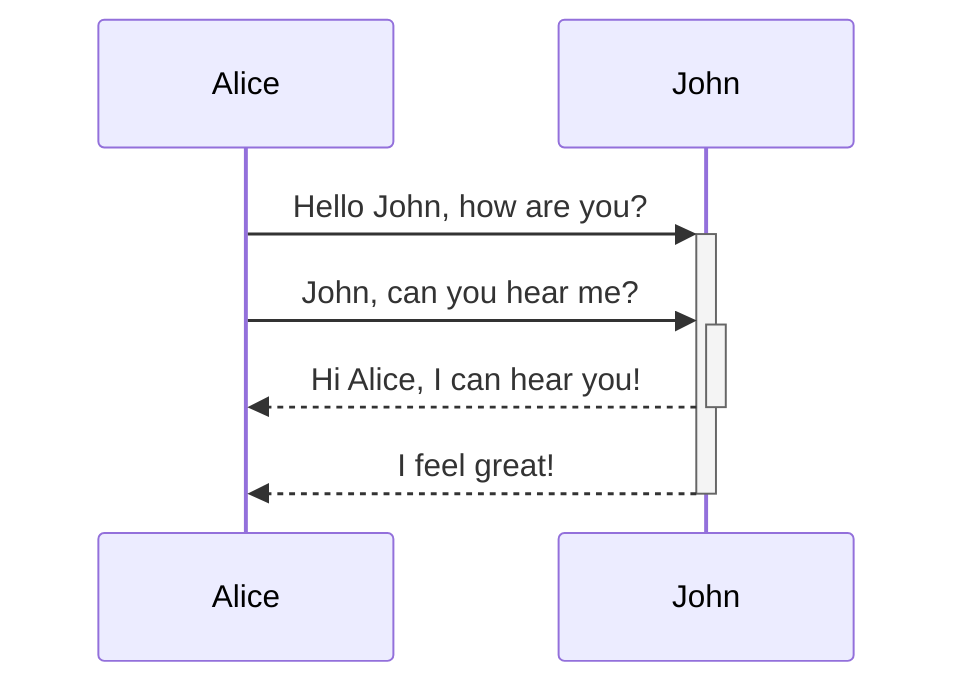
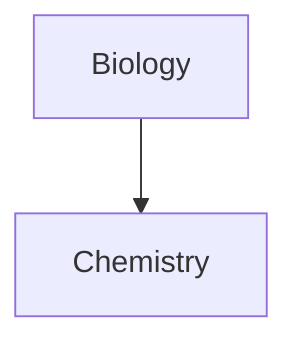

## Оглавление
* [1. Обзор](#1-обзор)
* [2. Внутренние ссылки](#2-внутренние-ссылки)
	* [2.1. Поддерживаемые форматы внутренних ссылок](#21-поддерживаемые-форматы-внутренних-ссылок)
	* [2.2. Ссылки на файлы](#22-ссылки-на-файлы)
	* [2.3. Ссылки на заголовки в заметках](#23-ссылки-на-заголовки-в-заметках)
	* [2.4. Ссылки на блоки в заметках](#24-ссылки-на-блоки-в-заметках)
	* [2.5. Изменение текста ссылок](#25-изменение-текста-ссылок)
* [3. Вставка файлов](#3-вставка-файлов)
	* [3.1. Вставка одной заметки в другую](#31-вставка-одной-заметки-в-другую)
	* [3.2. Вставка изображений в заметки](#32-вставка-изображений-в-заметки)
	* [3.3. Вставка аудио-файлов в заметки](#33-вставка-аудио-файлов-в-заметки)
	* [3.4. Вставка PDF-файлов в заметки](#34-вставка-pdf-файлов-в-заметки)
* [4. URI-ссылки Obsidian](#4-uri-ссылки-obsidian)
* [5. Игнорирование символов](#5-игнорирование-символов)
* [6. Блоки кода](#6-блоки-кода)
* [7. Списки задач](#7-списки-задач)
* [8. Метаданные](#8-метаданные)
	* [8.1. Формат метаданных](#81-формат-метаданных)
	* [8.2. Метаданные Obsidian](#82-метаданные-obsidian)
	* [8.3. Тэги](#83-тэги)
	* [8.4. Алиасы](#84-алиасы)
* [9. Вычисления](#9-вычисления)
* [10. Комментарии](#10-комментарии)
* [11. Выноски](#11-выноски)
	* [11.1. Типы выносок](#111-типы-выносок)
	* [11.2. Сворачиваемые выноски](#112-сворачиваемые-выноски)
	* [11.3. Вложенные выноски](#113-вложенные-выноски)
	* [11.4. Кастомизация](#114-кастомизация)
* [12. Диаграммы](#12-диаграммы)

## 1. Обзор
Для разметки, Obsidian использует
[синтаксис Markdown](https://github.com/bmigunov/docs-translated/blob/master/docs/markdown_syntax.md),
за исключением таких элементов, как: пользовательские идентификаторы заголовков,
списки определений, короткие коды emoji и индексация символов. Но, при этом,
доступны дополнительные элементы.

## 2. Внутренние ссылки
Связывая между собой заметки Markdown, можно создать "базу знаний".  
Obsidian автоматически по-умолчанию обновляет внутренние ссылки в хранилище при
переименовании файлов. Это поведение можно изменить в настройках.

### 2.1. Поддерживаемые форматы внутренних ссылок
Поддерживаются следующие форматы внутренних ссылок:

* Wikilink: `[[Three laws of motion]]`
* Markdown: `[Three laws of motion](Three%20laws%20of%20motion.md)`

Приведённые выше примеры эквивалентны. В случае с форматом Markdown,
используется [URL-кодирование](https://en.wikipedia.org/wiki/URL_encoding)
(кодирование знаком процента).  
По-умолчанию, Obsidian генерирует ссылки в формате Wikilink. Это поведение можно
изменить в настройках Obsidian.

### 2.2. Ссылки на файлы
Варианты создания ссылок на файлы:

* Начать вводить символы `[[` в редакторе и, затем, выберать файл, на который будет создана ссылка.
* Выделить текст в редакторе и, затем, ввести символы `[[`.
* Открыть "Палитру команд" сочетанием клавиш `Ctrl+P` и выбрать пункт "Добавить внутреннюю ссылку"

Ссылаться можно только на
[поддерживаемые форматы файлов](https://help.obsidian.md/Advanced+topics/Accepted+file+formats).
Ссылки на них (за исключением файлов Markdown) должны содержать расширение
файла.

### 2.3. Ссылки на заголовки в заметках
Существует возможность создать т.н. якорные ссылки на заголовки, в т.ч. и на
заголовки в других заметках.  
Для этого необходимо добавить знак "решётки" в конце адреса ссылки с последующим
указанием имени заголовка.  
Возможно использование нескольких знаков "решётки" для ссылок на вложенные
заголовки.

Пример: `[[My note#Heading 1#Heading 2]]`.

### 2.4. Ссылки на блоки в заметках
Блок - это единица текста в заметке. К примеру: параграф, цитата или список.  
Создать ссылку на "блок" возможно, добавив символы "решётки" и вставки в конце
адреса ссылки с последующим уникальным идентификатором "блока", к примеру,
`[[2023-01-01#^37066d]]`.  
Запоминать идентификатор не обязательно, т.к. при печати символа вставки (`^`),
можно выбрать "блок" из выпадающего списка с предложениями.  
Также возможно создать пользовательские, читаемые идентификаторы "блоков",
добавляя их в конец "блоков" при помощи символа вставки. Например:
`^quote-of-the-day`. Далее, создание ссылки на блок, помеченный данным
пользовательским идентификатором, будет выглядеть так:
`[[2023-01-01#^quote-of-the-day]]`.

### 2.5. Изменение текста ссылок
Существует возможность изменить текст ссылки.

**Для формата Wikilink:**  
`[[Internal links|custom display text]]`

**Для формата Markdown:**  
`[custom display text](Internal%20links.md)`

## 3. Вставка файлов
Для вставки файлов используется восклицательный знак (`!`) перед обозначением
[внутренней ссылки](#2-внутренние-ссылки). Ко вставке допускаются любые файлы
форматов,
[поддерживаемых Obsidian](https://help.obsidian.md/Advanced+topics/Accepted+file+formats).

### 3.1. Вставка одной заметки в другую
Формат вставки заметки следующий:

`![[Internal links]]`

Также возможнор вставлять заголовки и "блоки":

`![[Internal links#^b15695]]`

### 3.2. Вставка изображений в заметки
Формат вставки изображения следующий:

`![[Engelbart.jpg]]`

Существует возможность изменения размеров изображения, добавляя символ прямой
черты и разрешение отображаемого файла после ссылки на него, например:
`![[Engelbart.jpg|100x145]]`.  
Если указать только ширину, то размер будет изменён в соответствии с
пропорциями, например: `![[Engelbart.jpg|100]]`.

### 3.3. Вставка аудио-файлов в заметки
Формат вставки аудио-файлов следующий:

`![[Excerpt from Mother of All Demos (1968).ogg]]`

### 3.4. Вставка PDF-файлов в заметки
Формат вставки PDF-файлов следующий:

`![[Document.pdf]]`

Также возможно вставить только определённую страницу из PDF-файла, указав
сочетание `#page=` и номер страницы после пути к файлу:

`![[Document.pdfpage=3]]`

## 4. URI-ссылки Obsidian
Obsidian поддерживает
[специфичные ссылки](https://help.obsidian.md/Advanced+topics/Using+Obsidian+URI).
Они могут быть использованы для перехода по ним или из другого хранилища или из
другого приложения. Пример:

`[Link to note](obsidian://open?path=D:%2Fpath%2Fto%2Ffile.md)`

Также можно сослаться по имени хранилища вместо полного пути:

`[Link to note](obsidian://open?vault=MainVault&file=MyNote.md)`

## 5. Игнорирование символов
Если URL-адрес содержит пробелы, заменить их можно кодом `%20`:

`[Export options](Pasted%20image)`

Или же включить путь в треугольные скобки:

`[Slides Demo](<Slides Demo>)`

## 6. Блоки кода
См.:
[Синтаксис Markdown. 14.3. Выделенные блоки кода](https://github.com/bmigunov/docs-translated/blob/master/docs/markdown_syntax.md#143-%D0%B2%D1%8B%D0%B4%D0%B5%D0%BB%D0%B5%D0%BD%D0%BD%D1%8B%D0%B5-%D0%B1%D0%BB%D0%BE%D0%BA%D0%B8-%D0%BA%D0%BE%D0%B4%D0%B0).  
Obsidian поддерживает подсветку синтаксиса, используя Prism. Больше информации
по поддерживаемым языкам [здесь](https://prismjs.com/#supported-languages).

## 7. Списки задач
См.:
[Синтаксис Markdown. 14.8. Списки задач](https://github.com/bmigunov/docs-translated/blob/master/docs/markdown_syntax.md#148-%D1%81%D0%BF%D0%B8%D1%81%D0%BA%D0%B8-%D0%B7%D0%B0%D0%B4%D0%B0%D1%87).  
Дополнительно к функционалу Markdown, чекбокс может быть помеченным с
зачёркнутым текстом (`- [x]`), помеченным(`- [?]`) и непомеченным (`- [ ]`).

## 8. Метаданные
Метаданные добавляются в заметку на первой строке. "Блок" метаданных должен
начинаться и заканчиваться последовательностью из трёх дефисов (`---`). Примеры:

**С использованием YAML**  
```markdown
---
tag: journal
publish: false
---

# Daily note

Text
```

**С использованием JSON**  
```markdown
---
{
	"tag": "journal",
	"publisher": false
}
---

# Daily note

Text
```

### 8.1. Формат метаданных
Для хранения метаданных в Obsidian, рекомендуется использует формат
[YAML](https://yaml.org/).  
Также возможно использование формата [JSON](https://www.json.org/).

### 8.2. Метаданные Obsidian
Obsidian может использовать следующий набор метаданных:

| Ключ       | Описание                                                                                                                                                                                                                                                                              |
|------------|---------------------------------------------------------------------------------------------------------------------------------------------------------------------------------------------------------------------------------------------------------------------------------------|
| `tag`      | См.: [8.3. Тэги](83-тэги).                                                                                                                                                                                                                                                            |
| `tags`     | Алиас для `tag`.                                                                                                                                                                                                                                                                      |
| `alias`    | См.: [8.4. Алиасы](84-алиасы).                                                                                                                                                                                                                                                        |
| `aliases`  | Алиас для `alias`.                                                                                                                                                                                                                                                                    |
| `publish`  | Используется в [Obsidian Publish](https://help.obsidian.md/Obsidian+Publish/Introduction+to+Obsidian+Publish) для [автоматической выборки заметок к публикации](https://help.obsidian.md/Obsidian+Publish/Publish+and+unpublish+notes#Automatically%20select%20notes%20to%20publish). |
| `cssclass` | Позволяет стиллизовать отдельные заметки, [используя сниппеты CSS](https://help.obsidian.md/Extending+Obsidian/CSS+snippets).                                                                                                                                                         |

### 8.3. Тэги
Тэги - полезный способ группировки нескольких заметок для более лёгкого их
поиска.

Для того, чтобы пометить тэгом заметку, в в её метаданных необходимо добавить
соответствующий ключ с нужными значениями:

```markdown
---
tags:
 - tag1
 - tag2
---
```

Или же использовать символ "решётки" (`#`) с последующим текстом пометки:
`#tag1`.

Использование пробелов при создании тэгов запрещено. Также запрещено создавать
тэги, состоящие только из цифр. Запрещено испольщовать не-цифровые и
не-алфавитные символы, кроме символов нижнего подчёркивания (`_`) и дефисов
(`-`).

Возможно создание вложенных тэгов, например: `#inbox/to-read`,
`#inbox/processing`.

### 8.4. Алиасы
Для создания ссылок на файл с разными именами, в заметках исаользуются "алиасы".
Собственно, "алиас" - альтернативное имя заметки.

Пример использования - акронимы, псевдонимы или отсылка на заметку на другом
языке.

Для того, чтобы добавить заметку, необходимо поместить соответствующий ключ и
значения в метаданные:

```markdown
---
aliases: Doggo, Woofer, Yapper
---

# Dog
```

Для того, чтобы сослаться на заметку по её "алиасу", используется
[механизм внутренних ссылок](#2-внутренние-ссылки). Во время печати имени
нужного "алиаса", оно всплывёт в списке предложений с иконкой изогнутой стрелки
напротив.

## 9. Вычисления
Для рендера вычислений из нотации LaTeX, Obsidian использует
[MathJax](http://docs.mathjax.org/en/latest/basic/mathjax.html).  
Более подробная информация находится в
[инструкции по основам MathJax](https://math.meta.stackexchange.com/questions/5020/mathjax-basic-tutorial-and-quick-reference).  
Для списка поддерживаемых MathJax пакетов, обратитесь к
[списку расширений TeX/LaTeX](http://docs.mathjax.org/en/latest/input/tex/extensions/index.html).

## 10. Комментарии
Комментарии заключаются между последовательностями из двух символов знака
процента `%%` с обеих сторон.

***

**Markdown**  
```markdown
Here is some inline comments: %%You can't see this text%% (Can't see it in Reading mode)

Here is a block comment: (can't see it in Reading mode either)
%%
It can span
multiple lines
%%
```

**Вывод**  
Here is some inline comments: %%You can't see this text%% (Can't see it in Reading mode)

Here is a block comment: (can't see it in Reading mode either)
%%
It can span
multiple lines
%%

***

## 11. Выноски
Выноски поддерживаются в Obsidian с версии v0.14.0.  
Создаются, как цитаты, но в первой строке обозначается тип выноски внутри
квадратных скобок, предваряемый восклицательным знаком.

***

**Markdown**  
```markdown
> [!info
> Here's a callout block.
> It supports **Markdown**, [[Internal link|Wikilinks]], and [[Embedded files|embeds]]!
> ![[og-image.png]]
```  
**Вывод**  

> [!info]
> Here's a callout block.
> It supports **Markdown**, [[Internal link|Wikilinks]], and [[Embedded files|embeds]]!
> ![[og-image.png]]

***

Выноски могут иметь пользовательский заголовок.

***

**Markdown**  
```markdown
> [!tip] Callouts can have custom titles, which also supports ==markdown==!
```

**Вывод**  
> [!tip] Callouts can have custom titles, which also supports ==markdown==!

***

### 11.1. Типы выносок
Поддерживаемые типы:

* `note`
* `abstract`, алиасы: `summary`, `tldr`
* `info`
* `todo`
* `tip`, алиасы: `hint`, `important`
* `success`, алиасы: `check`, `done`
* `question`, алиасы: `help`, `faq`
* `warning`, алиасы: `caution`, `attention`
* `failure`, алиасы: `fail`, `missing`
* `danger`, алиасы: `error`
* `bug`
* `example`
* `quote`, алиасы: `cite`

### 11.2. Сворачиваемые выноски
Имеется возможность создавать сворачиваемые выноски, добавляя в определении
символы `+` (выноска будет развёрнута) или `-` (выноска будет свёрнута) после
квадратных скобок.

***

**Markdown**
```markdown
> [!faq]- Are callouts foldable?
> Yes! In a foldable callout, the contents are hidden until it's expanded.
```

**Вывод**  

> [!faq]- Are callouts foldable?
> Yes! In a foldable callout, the contents are hidden until it's expanded.

***

### 11.3. Вложенные выноски
Выноски можно вкладывать друг в друга (ровно, как и
[|цитаты](https://github.com/bmigunov/docs-translated/blob/master/docs/markdown_syntax.md#6-%D1%86%D0%B8%D1%82%D0%B0%D1%82%D1%8B)).

***

**Markdown**  
```markdown
> [!question] Can callouts be nested?
> > [!todo] Yes!, they can.
> > > [!example] You can even use multiple layers of nesting.
```

**Вывод**

> [!question] Can callouts be nested?
> > [!todo] Yes!, they can.
> > > [!example] You can even use multiple layers of nesting.

***

### 11.4. Кастомизация
Сниппеты и плагины могут определять пользовательские выноски. Типы выносок и их
иконки определены в CSS, где цвета - это `r, g, b`, иконки обозначаются
идентификаторами любых поддерживаемых иконок (напр.: `lucide-info`). Можно
определить SVG-иконку строкой.

```css
.callout[data-callout="my-callout-type"] {
	--callout-color: 0, 0, 0;
	--callout-icon: icon-id;
	--callout-icon: '<svg>...custom svg...</svg>';
}
```

## 12. Диаграммы
Obsidian использует [Mermaid](https://mermaid-js.github.io/) для рендера
диаграмм и графиков. Mermaid также предоставляет
[собственный редактор](https://mermaid-js.github.io/mermaid-live-editor). Ниже
будет рассмотрено несколько примеров.

***

**Markdown**

    ```mermaid
    sequenceDiagram
	    Alice->>+John: Hello John, how are you?
	    Alice->>+John: John, can you hear me?
	    John-->>-Alice: Hi Alice, I can hear you!
	    John-->>-Alice: I feel great!
    ```

**Вывод**



***

Obsidian поддерживает ссылки на заметки внутри диаграмм Mermaid.

***

**Markdown**

    ```mermaid
    graph TD

    Biology --> Chemistry
    class Biology,Chemistry internal-link;
    ```

**Вывод**



***

Альтернативный вариант:

***

**Markdown**

    ```mermaid
    graph TD
    A[Biology]
    B[Chemistry]

    A --> B

    class A,B,C,D,E,F,G,H,I,J,K,L,M,N,O,P,Q,R,S,T,U,V,W,X,Y,Z internal-link;
    ```

***

Если используются специальные символы в именовании заметок, имя заметки
необходимо включить в двойные кавычки: `"* special char*"` (или
`A["* special char"]`, если следовать альтернативному варианту).
